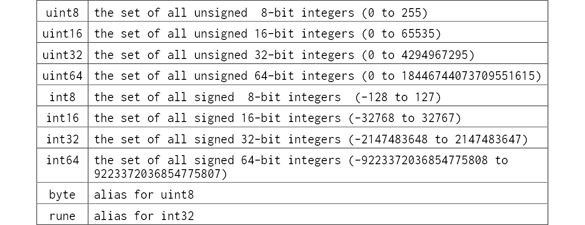

# Go Core Types
The Go core types are not intuitive, they were born out of a need to make humans understand and work with data that the computer consumes as binary. 

What I mean is that, computers works solely in binary. Humans have a hard time working with binary. Go comes in and provides an abstraction over the binary in such a way that humans can know what data the computer is consuming at that point and how to make it easy for the human to manipulate and structure the data.

- Go does this using `types`. Basically, a type is the way data is stored in Go.
- The things that define a type are:
  - the kind of data that can be stored in it
  - the operations it can be used with
  - what the operations can do with it
  - how much memory it can use

### True or False
- The true and/or false loginc is implemented by the `bool` type. 
- This is used when you need and on/off switch in the code.
- The value of a `bool` can only ever be `True` or `False`.
- The default or zero value of a bool is always `False`.
- When using comparison operators, the result of that operation/logic is always a `bool`.
- Using a `bool` gives your code the ability to make choices and be dynamic and responsive.

### Numbers
- Go has two distinct number types, integers and floating-points.
- In normie language, these are the whole numbers and decimals/fractions.
- the default value for all these number types is zero.

  #### Integer
  - Integers are classified according to two ways:
    - whether they can store negative values or not
    - the smallest and largest number they can store
  - types that can store negative numbers are called `signed integers` and those that cannot are called `unsigned integers`.
  - how big or small a number an integer can store is expressed by how many bytes of internal storage it has.
  - Go has the integer types defined as 
  - The problems related to `int` tend to be related to memory usage.
  - Eg: you have an app that is running out of memory. The app uses a massive number of integers, but these are never negative and won't go over 255. One possible fix is to switch from using `int` to using `uint8`. Doing this cuts the memory usage from 64-bits (8 bytes) per number to 8 bits (1 byte) per number.
    - this can be shown by creating a collection of both kinds of types and then asking Go how much heap memory it is using. The code creates a collection of `int` and `int8`; adds 10 million values to the collection. Use the `runtime` package to give a reading of heap memory used. Convert the reading to MB.
  ```go
  package main

  import (
    "fmt"
    "runtime"
  )

  func main() {
    var list []int
    for i := 0; i < 10000000; i++ {
      list = append(list, 100)
    }
    var m runtime.MemStats
    runtime.ReadMemStats(&m)
    fmt.Printf("TotalAlloc (Heap) = %v MiB\n", m.TotalAlloc/1024/1024)
  }
  ```
  #### Floating Points
  - Floating points have two(2) variants, the `float32` and `float64`.
  - floating points split their storage between whole numbers and decimal numbers. `float64` has more storage than `float64`.

  #### Overflow and Wraparound
  - when you try to initialize a number with a value larger than what the type takes, you get an overflow error. eg the `int8` has a max value of 127. Anything aboe that gives an overflow error.
  - an easily fixable problem. The issue then comes when the compile cannot seem to catch it. 
  - when the compiler does not catch this, the number goes into ".wraparound". This means that the number goes from the highest possible value to the smallest possible value. Wraparound is easy to miss and can cause problems for users.

  #### Big Numbers
  - If a numbeer higher or lower than `int64` or `uint64` can give, use the `math/big` package. This provides an API that can be used to do a lot with integers.
  
  #### Byte
  - the `byte` is alias for `uint8`; which is just a number that has 8 bits of storage.
  - the `byte` is a significant type used in computing all over.
  - a `bit` is a single binary value, representing a single on/off switch. It became a way to universally encode data. 8 bits have 256 possible combinations of "off" and "on", and `uint8` has 256 possible integer values from 0 - 255. All combinations can then be represented with this type.
  - the byte is used when reading and writing data to a network connection or when writing/reading to/from files.

### Text
- Go has `strings` to represent text.
- Write some text for a string and it is called a string literal. There are two types:
  - Raw - defined by wrapping the text in backticks (``).
  - Interpreted - defined by wrapping the text in double-quotes ("").
  - with Raw, the text that ends up in the variable is exactly what is seen in screen; with Interpreted, Go scans the text and applies transformations based on its own set of rules.
- Interpreted string literals are common in real-world code but when you want to copy code that has a lot of new lines, " or \, it is easier to use *raw*.

  #### Rune
  - the `Rune` is a type of storage to store a single UTF-8 multi-byte character.
  - string literals are encided using UTF-8. UTF-8 is a popular and common multi-byte text encoding standard.
  - the strings are not limited to only UTF-8 characters, as Go needs to support other text encodings as well.
  - the different encodings mean that, a different number of bytes are used to encode text.
  - legacy standards use a single byte to encode a single character; UTF_8 uses 4 bytes for a single character.
  - when text is in the `string` type, Go stores all strings a byte collection. To perform any type of operation with any kind of encoding, single or multi-byte, the string/text needs to be converted from a byte collection to a rune collection.
  **NB**: If the kind of encoding used on a text is not know, it is safe to convert it to UTF-8.
  - It is not advisble to use len on a string when trying to loop over the characters especially, when they are UTF-8. By constraining it to use the len, multi-byte characters included will use up space and the string will have less characters than was originally written.
  - working with strings, check and use the `strings` package.

  #### the nil value
  - `nil` is a special value in Go that represents an empty value. 
  - when trying to interact directly with a nil value, the Go code will crash. You need to check whther the value is nil or not before trying to interact with it.
  