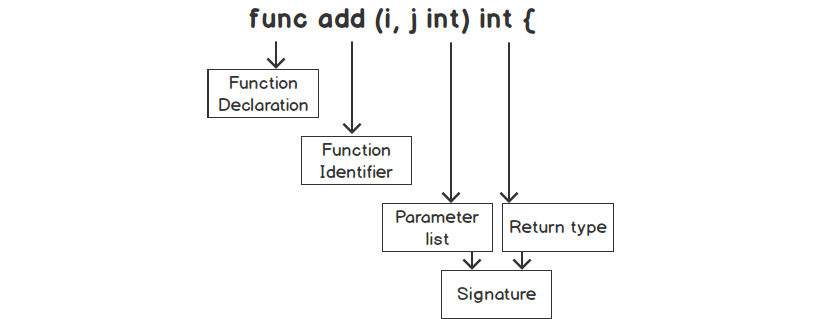

# Functions
- describe various parts of a function in detail:
  - define a function, function identifiers, parameter lists, return types and the function body.
- best practice when designing functions; reducing function code, reusability, modularity.

- A function is best described as a section of code that has been declared to perform a specific task.
- Go can have zero or many inputs or outputs in their functions. One cool feature of Go is that, the function have multiple return values.
- Go has support for first-class functions ie. Go has the ability to assign a variable to a function, pass a function as an argument, and have a function as a return type for a function.
- Functions in Go are considered first-class citizens and higher-order functions.
  - first-class citizens are the functions that are assigned to a variable.
  - higher-order functions are functions that can take a function as an argument.
- Go functions can be used in the following ways:
  - functions to be passed as an argument to another function
  - return a function as a value from a function
  - functions can be used as types
  - closures (I do not know what this is yet.)
  - as anonymous functions
  - functions assigned to a variable

## Reasons For Using Functions
- Here are some of the reasons for using functions in any given language:
  - **breaking up a complex task** : functions are used to perform a task, if the task is complex, break it down into smaller tasks. Functions can be used for those smaller tasks too. Smaller tasks are mor manageable and using a function to solve specific tasks will make the codebase easier to maintain.
  - **reducing code** : a good indication to use functions is when there is duplicate code performing the same task in the program. Having duplicate code increases the difficulty of maintenance.
  - **single responsibility** : a function should perform one task ONLY. Eg. a function should not calculate the perimeter of a shape and also the area of the shape. Each should be a separate function. It is quite difficult to narrow down a function to a single responisibility, you might not get it down the first time.
  - **small in size** : functions should not span over hundreds of lines of code. With large-code functions, it is likely that the single responibility principle will be violated. A good rule of thumb is to limit the function code to 25 lines; this is not a rigid rule. Keeping the function code concise reduces the complexity of debugging a large function. Also makes writing unit tests that have better code coverage easier.

## Parts of a Function
- Here are the different components involved in defining a function.
- The image below is the typical layout of a function: 
- The different parts of a function are describe here:
  - **func** : the function declaration starts with this (*func*) in Go.
  - **identifier** : this is also referred to as the function name. In Go, it is idiomatic to use camelCase for the *identifier*.
    - the identifier should be descriptive, making the purpose of the function easy to comprehend.
    - there can be no identifier, and in this case, the function will be an anonymous function.
    - when writing identifiers, keep in mind the scope the function will be called. A identifier that starts with a lower-case letter will have package-level scope. For an exportable function (a function to call everywhere within the program) use an upper-case letter to start the identifier.
  - **parameter list** : parameters are inputs to a function. A parameter is data required by the function to perform the task the function has to undertake.
    - it is optional to have parameters. A function can have zero or many parameters.
    - the parameter notation is like this; `<name> <type>`. Eg. *(name string, age int)*. There is shorthand for parameters of the same type. eg. *(name, address string)*; this reduces verbosity and increases readability of the parameter list.
  - **return type** : return types are a list of data types that can be returned, such as boolean, string, map or another function. In the context of declaring a function, they are referred to as return types. However, in the context of calling function, they are referred to as return values.
    - return types are the output of a function. Often, they are the results of the arguments provided to the function.
    - you can have multiple return types in Go.
  - **function body** : the function body is the coding statements between the curly braces, **{}**. These statements are what determine what the function does; it is the code used to perform the task the function was created to execute.
    - if there are return type defined, then a **return** statement is required in the function body. The return causes the function to stop executing an return the value types specified with the return statement. The types in the return type list and in the return statement must match.
    - there can be multiple return statements in the function body.

  ## Parameters
  - Parameters define what arguments can be passed to a function. Functions can have zero or more parameters.
  - Having a huge parameter list means that the function is violating the single responsibility principle and need to be refactored.
  - Limiting the parameters helps you to develop the sense of building a function to perform a single responsibility. The parameters to define should be the ones needed to solve the specific problem that the function is built for.
  - Parameters, as said before, are the input types that the function uses to perform its task. The parameters are local to the function and they are not available outside of the context of the function.
  - When printing out parameter values, the order must match the way the parameters are declared in the function.

    ### The Difference between an Argument and a Parameter
    - When defining a function, eg. `getLost(town string)`, *end int* this is the parameter. 
    - When calling a function, eg. `getLost("Scranton")`, *Scranton* is the argument.

  ## Function Variable Scope
  - In designing functions, we need to consider the variable scope.
  - The scope of a function determines where the variable is accessible from OR its visibility to the different parts of the program.
  - There are two variable scopes; local variables and global variables.
    - local variables are variables declared inside a function. They are only accessible by the code within the function.
    - variables declared in a **calling** function are scoped to that function, they are not accessible outside of the function. For the **called** function to get access to the **calling** function's variables, they must be passed in the **called** function as input parameters.
    ```go
    // this is a demonstration
    func greeting() {
      fmt.Printf("Greetings %s", m)
    }

    func main() {
      m := "Uncle Bob"
      greeting()
    }

    // the output will be (undefined: m)
    ```
    - the output will result in m being undefined. This is because the *m* variable is declared inside *main()* and the *greeting()* function does not have access to the *m* variable. For it to have access, the *m* variable has to be passed to the *greeting()* function as an input parameter.
    ```go
    // another demo
    func greeting(name string) {
      fmt.Printf("Greetings %s", name)
      s := "slacker"
      fmt.Printf("Greetings %s", s)
    }

    func main() {
      m := "Uncle Bob"
      greeting(m)
      fmt.Printf("Hi from main: %s", s)
    }
    ```
    - the same undefined problem occurs with *s*. This is because the *main()* function does not have access to *s*.

  ## Return Values
  - Functions typically accept inputs, perform some actions on those inputs and then return the results of these inputs.
  - In Go, you can return multiple values while other languages allow for the return of only one.

  ## Naked Returns
  - Functions that have return values must have a return statement as the last statement in the function. The compiler throws an error when the return statement is omitted.
  - Typically in Go, when a function returns two types, the second type is is of type **error**. It is an idiomatic way of writing Go code.
  - Go also allows the possibility of a return value being ignored. The *blank* identifier (*_*) is used for this. We ignore a return value when that data is not needed by the program. Eg. when reading a file, we ignore the data returned, we are however interested in whether the file was read successfully or not. `_, err := file.Read(bytes)`.
  - when a placeholder, like th blank identifier is used, the position must match the postion of the return values specified in function. eg. in the fizzBuzz code, `_, s :- fizzBuzz(i)`; the *_* and *s* are placeholders for the *int* and *string* specified as return values.
  - Go has a feature that allows you to name your returns. This makes code more readable and self-documenting. If the return values are named, they are under the same constraints as local variables. By naming the return values, you are making them local varibales in the code/function and you can assign values to them
  ```go
  func greeting() (name string, age int) {
    name = "Taskmaster"
    age = 145
    return name, age
  }
  ```
  - In the preceding code, the local variables are the return values and they are specified as they are called in the return statement.
  - If you do not specify the variable name in the return statement, this is called a **naked return**.
  ```go
  func greeting() (name string, age int) {
    name = "Ernest"
    age = 154
    return
    // naked return
  }
  ```
  
  ## Variadic Functions
  - The variadic function is one that acceptsa variable number of argument values.
  - a variadic function looks like this **`func f(paramterName ...Type)`**. The **(...)** is called a **pack operator**. The pack operator is what makes a variadic function. It tells Go to store all the arguments of **Type** in to the **parameterName**.
  - the variadic function can have many other parameters. If the function requires multiple parameters, the variadic parameter must be literally the last parameter listed. And there can only be one variadic parameter per function.
  ```go
  func nums(i ...int) {
    fmt.Println(i)
  }

  func main() {
    nums(99, 100)
    nums(345)
    nums()
  }
  ```
  - the actual type of **Type** in the variadic function is a **slice**. The function takes the arguments being passed in and stores them in a slice. As such, you cannot pass a slice into a variadic parameter, since the variadic parameter converts the arguments into a slice in the function.
  - but that being said, Go has a way to enable passing a slice into a variadic function, using the **unpack operator (...)**. In this case, you need to place the **unpack operator** after the slice you want to pass as an argument in to the variadic function.
  ```go
  func nums(i ...int) {
    fmt.Println(i)
  }

  func main() {
    i := []int{1,3,5,7}
    // using the unpack operator
    nums(i...)
  }
  ```

  ## Anonymous Functions
  - Anonymous functions, also referred to as function literals, are functions that do not have a name or identifier.
  - they are declared the same way named functions are but the difference between these declarations is that, the anonymous functions do not have a name.
  - anonymous functions do everything a normal (named) function does, including accepting arguments and returning values.
  - anonymous functions can be used **for** and **in** conjunction with the following:
    - closure implementations (wth are these??)
    - defer statements
    - defining a code block to be used with a Goroutine
    - defining a function for one-time use
    - passing a function to another function
  ```go
  func main() {
    func() {
      fmt.Println("Greetings")
    }()
  }
  ```
  - the last set of parentheses after the anonymous functions are the execution parantheses. When placed there, they invoke the functin immediately.
  - also, there is a way to invoke an anonymous function at a later location within the fuction.
  - arguments can also be passed in the anonymous function. To be able to use these arguments, they must be supplied in the execution parentheses.
  ```go
  func main() {
    message := "Greetings"

    func(str string) {
      fmt.Println(str)
    }(message)
  }
  ```
  - you can also save the anonymous function to a variable. The varibale is assigned to the anonymous function; the variable becomes a func type; and the execution parentheses have to be added to invoke the function.
  - write anonymous functions when you need functions that are NOT going to be reusable in the program.
  ```go
  func main() {
    f := func() {
      fmt.Println("executing and anonymous function using a variable")
    }
    fmt.Println("Line after the anonymous function")
    f() // execute
  }
  ```

  ## Closures
  - Closures are a form of anonymous functions.
  - Regular (named) functions cannot reference variables defined outside of themselves; however, an anonymous function has the ability to reference variables that are external to its definition.
  - a closure can use variables declared at the same level as the anonymous function. It does not need the variable to be passed in as an input parameter, it simply has access to these variables when it is called.
  ```go
  func main() {
    i := 0
    incrementor := func() int {
      i += 1
      return i
    }
    // call function
    fmt.Println(incrementor()) // 1
    fmt.Println(incrementor()) // 2
    // change value of i
    i += 10
    fmt.Println(incrementor()) // 13
  }
  ```
  - one problem with the code implememtation above is that, the value **i** is accessible and can be changed by any code in the program. ie. **i** can be changed outside of the function.
    - we can have **i** isolated such that only the anonymous closure will be the only one to have access and make changes to it. ie. the anonymous function will be the ony code to have access to the **i** variable and will be the only one to change it.
  ```go
  func incrementor() func() int {
    i := 0
    return func() int {
      i += 1
      return i
    }
  }

  func main() {
    increment := incrementor()
    fmt.Println(increment())
    fmt.Println(increment())
  }
  ```

  ## Function Types
  - Functions in Go are types too, just like int, string, bool etc.
  - This means we can do these things: 
    - pass functions as arguments to other functions
    - return functions from a function
    - assign functions to variables
  - You can define your own function types. The type signature (check function image above) defines the input parameters and the return values.
  - Therefore, for a function to be of the type of another function, it must have the same exact signatue of the type function that is declared. The code below will illustrate the statment more.
  ```go
  type calc func(int, int) string

  func calculator(f calc, i, j int) {
    fmt.Println(f(i, j))

  }

  func add(i, j int) string {
    result := i + j
    return fmt.Sprintf("computed %d + %d = %d\n", i, j, result)
  }

  func main() {
    calculator(add, 5, 6)
  }
  ```

  ## Defer
  - The **defer** statement defers the execution of a function until the surrounding function returns.
  - when you call the defer keyword on a function, this particular function will be the last thing to be executed. All other things will be executed before this.
  ```go
  func done() {
    fmt.Println("I am now done")
  }

  func main() {
    defer done()
    fmt.Println("One more")
    fmt.Println("Another one")
  }
  ```
  - **defer** functions/statements are commonly used for performing clean-up activities. This includes the release of resources, closing of files, the closing database connections and the removial of the configuration/temp files created by a program.
    - the **defer** is also used to recover from a **panic**.
  - the **defer** is not limited only to named functions but also can be used with anonymous functions
  ```go
  func main() {
    defer func() {
      fmt.Println("Now I am done")
    }()
    fmt.Println("One more")
    fmt.Println("Another one")
  }
  ```
  - multiple **defer** statements can be declared. They are executed in a **First In Last Out** order.
  - a unique situation is where the **defer** functions or statements are used in conjunction with variables.
    - when a variable is passed to a deferred function, the variable's value **at that time** will be used in the deferred function.
    - if the value of the variable is changed, it will not affect the value that is passed to the deferred function.
  ```go
  func personAge(name string, age int) {
    fmt.Printf("%s is %d\n", name, age)
  }

  func main() {
    age := 25
    name := "John"
    defer personAge(name, age)

    age += 3
    fmt.Printf("age increased; now %d\n", age)
  }
  ``` 