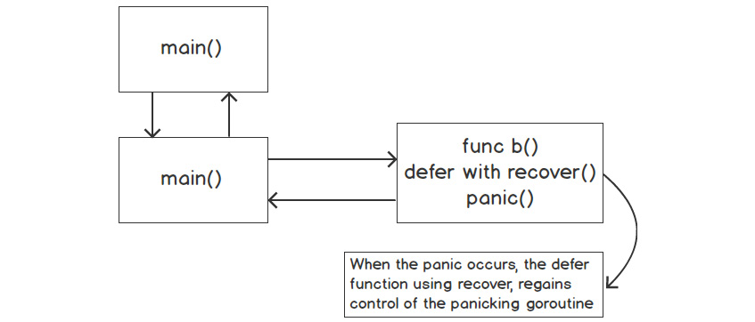

# Errors
In this suite of learning, you and I will learn about the idiomatic way Go performs error handling. You will see how to create custom errors and see the examples of these from the Go standard library.
You will be able to distinguish between error handling and exception handling.
Also, you will see how to use **panic()** to handle errors and recover after a panic.

## Introduction
- Everyone writes code that produces errors or has done so at some point in time in their lives. These errors, when not handled well, can have a negative effect of varying degrees on the users of the program. Every program is important, you may not know the far-reaches your program/error will get to and affect.
- Functions can return errors and you will learn how to return those from functions.

## What are Errors?
- An error can be defined as someting that causes your program to have unintended results/outcomes.
- Errors are referred to as software bugs, and these come about due to scenarios the developer/software architect may not have anticipated.
- What are some of the things that occur to prove that there is a software bug?
  - application crashing without warning
  - the program returning the wrong results/the program doing the wrong thing
  - an error message being displayed
- There are three types of errors out there to encounter:
  - syntax errors
  - runtime errors
  - semantic errors

  ### Syntax Errors
  - Syntax errors result from the improper use of the programming language. Often from mistyping/misrepresenting something.
  - most modern IDEs have away of catching these errors quickly.

  ### Runtime Errors
  - Runtime errors occur when the code is tasked to perform an action it cannot do/has not been explicitly programmed for.
  - these errors occur when the code is running, hence the name, runtime errors.
  - some examples of these are: opening a connection to a non-existing database; performing an impossible mathematical operation; opening a file that does not exist etc.

  ### Semantic Errors
  - Semantic errors are errors that occur as a result of invalid logic being run through an algorithm, producing erroneous code OR valid logic being run through an invalid algorithm.
  - either ways, the actual intended result is not what can be worked with.
  - an example of this is; logic performs calculations in metric units but over the algorithm, it converts this to imperial units and fails to state the results are for imperial units but attaches the metric moniker to it. In here, the calculation has been done perfectly but the result is erroneous.
  - because of these, semantic errors are harder to debug than all the other error types.
  - some reasons for semantic errors to return are:
    - incorrect computations
    - accessing incorrect resources
    - incorrect setting of variables

## Error Interface Type
- An error is a value in Go.
- Since an error is a value, it can be passed into a function, returned from a function and evaluated like any other value in Go.
- An error, as described in code in Go, is anything that implements the Error interface.
```go
type error interface {
  Error() string
}
```
- So to satisfy the error interface, there needs to be two things;
  1. the method name, `Error()`
  2. the `Error()` methods needs to return a `string`.
- It is important to note that, the error type is an interface type. And that, any value that is an error can be described as a string.
- Here is some code to start a discussion on Go errors:
```go
import (
  "fmt"
  "strconv"
)

func main() {
  v := "10"
  if s, err := strconv.Atoi(v); err == nil {
    fmt.Println("%T, %v\n", s, s)
  } else {
    fmt.Println(err)
  }

  v := "s2"
  s, err := strconv.Atoi(v)
  if err != nil {
    fmt.Println(s, err)
  }
}
```
- It is idiomatic to evaluate the value of errors that are returned from function or methods.
- When an error is not handled, it can lead to lots of wasted debugging efforts. If the value that is returned is not nil, we must decide on how to handle it. We might want to do any of the following:
  1. return the error to the caller
  2. log the error and continue execution
  3. stop the execution of the program
  4. ignore it (Not recommended)
  5. panic (only in very specific conditions)

- Going deep into the error package and looking at error types, here is an interesting bit of code:
```go
type errorString struct {
  s string
}
```
  - this `struct` `errorString` is in the errors package.
  - this struct is used to store the string version of the error.
  - the struct has a single field `s` that is of type `string`.
  - both the `errorString` and the field `s` are unexportable; meaning we cannot access the `errorString` type OR its field, `s`, directly. This code below tries to do that, and fails:
  ```go
  import (
    "fmt"
    "errors"
  )

  func main() {
    es := errors.errorString{}
    es.s = "slacker"
    fmt.Println(es)
  }
  ```
  - We can make this functional and accessible by making it satisfy the error interface.
  ```go
  func (e *errorString) Error() string {
    return e.s
  }
  ```
  - with this implementation, we have satisfied the error interface; a method name, `Error()` and a `string` returned.
  - We now have access to the `errorString` field, `s`, through the `Error()` method. And this is how an erros is returned within the Go standard library.

## Creating Error Values
- In the Go standard library, there is an error package that we can use to create our own errors.
```go
// New returns an error that formats as the given text
func New(text string) error {
  return &errorString{text}
}
```
- the `New` function takes a string as an argument and converts it to a `*errorString` and then uses that to return an error value (that is a string).
- the underlying type of the error value returned is of the `*errors.errorString` type. How do we know?
```go
import (
  "fmt"
  "errors"
)

func main() {
  ErrBadData := errors.New("some bad data")
  fmt.Printf("ErrBadData type: %T\n", ErrBadData)
}
```

## Panic
- Other languages use execptions for handling errors, Go does not use exceptions but uses **panic**.
- Panic causes the built-in function that causes the program to crash. It stops the normal execution of the *goroutine*.
- Panic is not the norm in Go. A panic signal indicates that something abnormal is happening in the program. A panic is usually initialted by the runtime or developer, and this is done to protect the integrity of the program.
- Errors, when they occur, will not adversely affect the integrity of the program. Go expects the developer to handle the error BUT functions and other programs will NOT crash.
  - Panic, on the other hand, will crash the system when there are no handlers to handle the panic. If there are no handlers, it will go all the way down the stack and crash the program.
  - a typical example is trying to access an index that is out of range. If Go does not panic, it could have an adverse impact on the integrity of the program, like, other parts of the program trying to store or retrieve data that is not present in the collection.
- A **panic()** function accepts an empty interface, ie, it can accept anything as an argument. But it is much better, idomatic even, to pass an error type to the **panic()** function. This way, whoever encounters the panic will have an idea of what caused the panic.
  - passing in the error type provides different options on recovering from the panic. When the panic occurs, it will follow these steps:
    1. the execution is stopped
    2. any deferred functions in the panicking function will be called
    3. any deferred functions in the stack of the panicking function will be called
    4. it will continue all the way up the stack until it reaches ** main()**
    5. statements after the panicking function will not execute
    6. the program then crashes
- An example of how to use **defer** with **panic()**:
```go
import (
  "fmt"
  "errors"
)

func test() {
  n := func() {
    fmt.Println("Defer in test function")
  }
  defer n()
  msg := "good-bye"
  message(msg)
}

func message(msg string) {
  f := func() {
    fmt.Println("Defer in message function")
  }
  defer f()

  if msg == "good-bye" {
    panic(errors.New("something went wrong"))
  }
}

func main() {
  test()
  fmt.Println("This line will not get printed")
}
```
- Let us break down this code:
  - we will start with the **message()** function since this is where the panic starts. When the panic occurs, it runs the defer statment within the panicking **message()** function.
  - going up the stack, the **test()** function and its corresponding **n()** anonymous function runs
  - finally, we get to the **main()** function where the execution is stopped by the panicking function. In here, the print statement is not executed because the panicking **message()** function has stopped the execution of anything more.
- the **os.Exit()** method is also used to stop the execution of programs. **os.Exit()** stops execution immediately and returns a status code. No deferred statments are run when **os.Exit()** is performed.

## Recover
- Go provides a way to regain control of a program after a panic has occurred. The way provided is the **recover()** function, which is used to regain control of a panicking Goroutine.
- The signature of the *recover()* function is `func recover() interface{}`.
  - the *recover()* function accepts no arguments and returns an empty interface. The empty interface signifies that any type can be returned BUT it is used to return the value sent to the **panic()** function.
- the **recover()** function SHOULD be put in a defer function so that it gets executed before the panicking function terminates. This will enable it to restore the panicking function to normal execution.
- this diagram below shows the steps a program will take when using **panic()**, **recover()** and a **defer()** function. 
- example code of how to recover from a panic:
```go
func a() {
  b("good-bye")
  fmt.Println("back in function a()")
}

func b(msg string) {
  defer func() {
    if r := recover(); r != nil {
      fmt.Println("error in func b()", r)
    }
  }()
  
  if msg == "good-bye" {
    panic(errors.New("something went wrong"))
  }

  fmt.Println(msg)
}

func main() {
  a()
  fmt.Println("this line will now get printed from main() function")
}
```

## Guidelines For Working With Errors And Panic
- Guidelines are for guidance. They are not set in stone. Follow them all the time but there can be exceptions.
- Here are the guidelines for working with errors and panics, consolidated:
  - when declaring our own error type, the varibae should start with **Err**. It should also follow the camelcase convention.
  - the **error** string should start with a lowercase letter and not end with a punctuation. One of the reasons for this is that, the error can be returned and concatenated with other info relevant to the error.
  - if a function or method returns an error, the error must be evaluated. Errors not evaluated can cause the program to not function as expected.
  - when using **panic()**, pass an error type as the argument, instead of an empty value
  - do not evaluate the string value of an error.
  - use the **panic()** function sparingly.