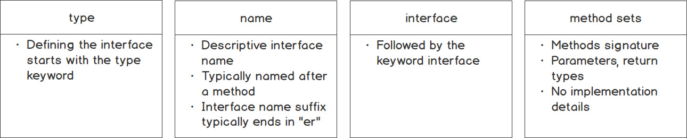
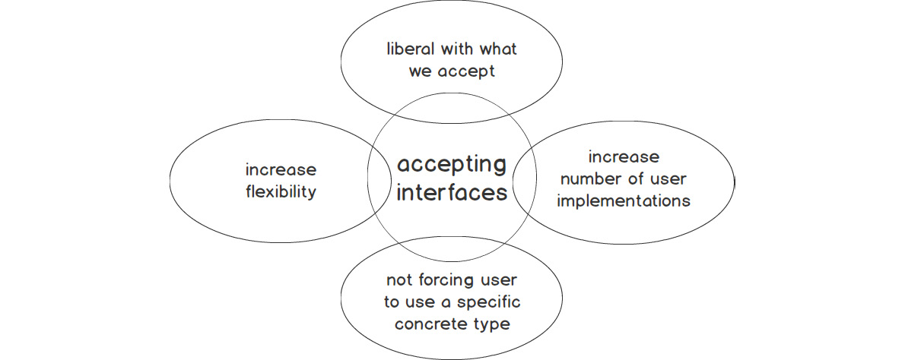

# Interfaces
- In here, we will learn how to define an interface, how to declare an interface for an application and also how to implement an interface in various applications.
- By the end, we will learn about duck typing and polymorphism, how to use type assertion to access the interface's underlying concrete value and finally how to use the type switch statement.

## Introduction
- Suppose you are working on a piece of code and you want to accept JSON data and parse that into a struct called **data**, you will probably write a function like this `func loadData(s string)`, and then load the data in the data struct.
- Also, suppose you want to load data into the same data struct but this time, you want to read the data from a file. You will probably use a function like this `func loadDataFromFile(f *os.File)`, and then load the data into the struct.
- Again, suppose...(ENOUGH OF THIS ALREADY!!!). Suppose you want to load data into the same data struct but this time you are getting the JSON data from over the internet via an HTTP request. You will probably use a function like this `func loadDataFromHTTP(r *http.Request)` and then load the data into the struct.
- All these three functions have a common behaviour that they are exhibiting: *reading the data / being able to read the data*. The underlying type of the data is different; *string, os.File and http.Request* but the behaviour of the functions are the same ie. to read the data.
- Now the behaviour to read the data in these various functions can be implemented by a single *interface*, the **io.Reader{}** interface. The **io.Reader** interface will cater for the read action to be taken by these functions.

## Interface (What is it?)
- An interface is defined in these ways:
  1. a way to specify the behaviour of an object (much less intuitive than I thought. Do better, Go docs, do better.)
  2. a set of methods that describe the behaviour of the data type. (much clarity to come as we lean into thid definition).
- Interfaces define the behaviour(s) of the type that must be satisfied to implement the interface. A/The behaviour describes what the type can do. eg, a car can start, stop, turn and accelerate; that is the behaviour of the car.
  - the behaviour for types are called **methods**.
- An interface can be described as a collection of method signatures. This is where you describe an interface with methods, and these methods must have the following: name of method, method's arguments, types and return types. 
  - An example of a collection of method signatures for the **Signature{}** interface is:
  ```go
  type Speaker interface {
    Speak(message string) string
    Greet() string
  }
  ```
  - This means that to satisfy this interface, the type must have a *Speak()* method, that takes in and returns a string and a *Greet()* method that returns a string.
  - basically whatever is going to call the *Speaker{}* interface must have a behaviour of speaking and greeting.
- Interfaces can be described as not having implementation details. The interface contains only the signature of the method but not the method's code. The implementer(coder) of the interface is responsible for providing the code or implementation details, and not the interfaces themselves.
- The behaviours to be exhibited by the interface are also called **method sets**.
  - a behaviour id defined by a set of methods; a method set is a group of methods.
  - these method sets comprise the method name, any input parameters and any return types.
- When defining interfaces, the implementation details are omitted. This gives the coder the ability to choose that each type implements according to the method sets provided by the interface.
  - if we go by the *Speaker{}* interface, and implement a human and a cat, we can implement the human type to speak with "aloha" and greet with "hi"; the cat can speak with "purr" and greet with "meow". Different implementations but same behaviour.
- **NB**: An important thing to note is that, the type(s) that contain the implementation details of the method sets is usually a *struct*.

## Defining an Interface
- The following steps can be followed to define an interface (from left to right): 
- It is idiomatic in Go to add **er** as a suffix to the name of the interface.
- Look at a most commonly used interface in Go:
```go
type Reader interface {
  Read(p []byte) (n int, err error)
}
```
  - the interface name is *Reader*; method set id *Read()* and the signature is *(p []byte) (n int, err error)*.
- Interfaces can have more than one method in its method sets. Taking a look at the *FileInfo* interface that fits this situation:
```go
type FileInfo interface {
  Name() string // base name of the file
  Size() int64 // length in bytes for regular files; system-dependent for others
  Mode() FileMode // file mode bits
  ModTime() time.Time // modification time
  IsDir() bool // abbreviation for Mode.IsDir()
  Sys() interface{} // underlying data source (can return nil)
}
```
- In the end, interfaces are types that declare method sets. The implementation details are NOT part of defining an interface.

## Implementing an Interface
- Interfaces in Go are implemented implicitly. This means that a type will implement the interface by having all the methods and their signatures of the interface.
- An example:
```go
type Speaker interface {
  Speak() string
}

type cat struct {}

func(c cat) Speak() string {
  return "Purr! Meow!"
}

func (c cat) Greeting() {
  fmt.Println("meeeooowwww!!!!")
}

func main() {
  c := cat{}
  fmt.Println(c.Speak())

  c.Greeting()
}

func main() {
  c := cat{}
  fmt.Println(c.Speak())
}
```
- from the code example, the type *cat* of type *struct*, in order to implement the Speaker interface, must have the method *Speak()* defined in the interface declaration.
- after adding the *Speak()* method to satisfy the *Speaker{}** interface, we(coder) now have to provide the implementation details for the *Speak()* method for the *cat*.
- there is no explicit detail that declares that *cat* implements the *Speaker{}* interface; it does so by just having met the requirements of the interface.
- also, note that there is also the *Greeting()* method and *cat* can use that BUT it does not implement/satisfy the *Speaker{}* interface.

### Advantages of Implementing Interfaces Implicitly
- You have noticed now that in Go, the type that satisfies an interface is said to implement it. There needs tp be no explicit keyword to state this.
- In Go, if the type has the method sets and the signatures of the interface, it implicitly implements the interface.
- Another advantage in that you can write interfaces for types that are in another package. This decouples the definition of an interface from its implementation.

- Taking a look at the **Stringer** interface that is used by serveral packages in Go. An example of this interface being used is in the **fmt** package, which is used for formatting when printing values.
```go
type Stringer interface {
  String() string
}

type Speaker interface {
  Speak() string
}

type cat struct {
  name string
  age int
}

func (c cat) Speak() string {
  return "Purr! Meow!!"
}

func (c cat) String() string {
  return fmt.Sprintf("%v (%v years old)", c.name, c.age)
}

func main() {
  c := cat{name: "Adelaide", age: 3}
  fmt.Println(c.Speak())
  fmt.Println(c)
}
```
- The cat type now implements two interfaces; the *Speaker{}* interface and the *Stringer{}* interface. And it has the methods that satisfy both interfaces.

## Duck Typing
- Duck typing is apparently a test in computer programming that says: *"If it looks like a duck, swims like a duck, quacks like a duck, then it must be a duck"*.
- **NB**: If a type matches an interface, then you can use that type wherever that interface is used.
- Hence, duck typing is matching a type based upon methods, rather than the expected type.
- Let us see this in practice (since I am also sincerly very confused at this point):
  - We say that anything that matches the *Speak()* method can be a *Speaker{}* interface. When implementing an interface, we are basically conforming to that interface by having the required method sets.
  ```go
  type Speaker interface {
    Speak() string
  }

  type cat struct {}

  func (c cat) Speak() string {
    return "Purr! Meow!!"
  }

  func main() {
    c := cat{}
    fmt.Println(c.Speak())
  }
  ```
  - Up above, the *cat* type matches the *Speak()* method of the *Speaker{}* interface, so a *cat* is a *Speaker{}*.
  - Below, we are going to do something different:
  ```go
  type Speaker interface {
    Speak() string
  }

  type cat struct {}

  func (c cat) Speak() string {
    return "Purr! Meow!!"
  }

  func chatter(s Speaker) {
    fmt.Println(s.Speak())
  }

  func main() {
    c := cat{}
    chatter(c)
  }
  ```
  - in the preceeding code, the *Speaker{}* interface was satisfied by having the *cat* type implement the *Speak()* method.
  - then a method called *chatter* was created that takes the *Speaker{}* interface as an argument.
  - in the main function, the *cat* type was passed into the *chatter* function, which then evaluates to the *Speaker{}* interface. And this satifies the required method sets for the interface.
  - LOL, I still do not understand.

## Polymorphism
- Polymorphism is the ability to appear in various forms. Eg. a shape can appear as any of these: square, triangle, rhombus, trapezium etc.
- Apparently, other object-oriented languages (whatever they are), do subclassing; which is basically inheriting  from one class to another. By doing this, they inherit the fields and methods of another class.
  - Go provides a similar to do this by embedding structs and using polymorphism through interfaces.
- An advantage of polymorphism is that, it allows the reuse of methods that have been written once and tested.
  - Code is reused by having an API that accepts an interface, if the type being received matches that interface, it can be passed to that API. 
  - There is no need to write additional code for each type; you just need to ensure that the type matches the interface's methods set requirements.
  - Obtaining polymorphism through the use of interfaces allows for resuability of the code.
  - If the API accepts only concrete types like *int, float or bool*, only that concrete type can be passed. However, if the API accepts an interface, then the caller can add the required method sets that satisfy the interface regardless of the underlying type.
  - As stated, reusability is accomplished by allowing the APIs to accept interfaces. Any type that satisfies teh interface can be passed to the API.
- **TIP**: When a function accepts an interface as an input parameter, any concrete type the implements that interface can be passed as an argument. With this, you have achieved polymorphism by being able to pass various concrete types to a method or function that has an interface type as an input parameter.
- Some progressive examples to get to understand polymorphism:
  1. *cat* satisfies the *Speaker{}* interface. The *main()* calles *catSpeak()* and takes a type of *cat*. Inside *catSpeak()* it prints out the results of its *Speak()* method.
  ```go
  type Speaker interface {
    Speak() string
  }

  type cat struct {}

  func (c cat) Speak() string {
    return "Moo! sike! Meow!!"
  }

  // implement a function that takes in the type and calls the method on it
  func catSpeak(c cat) {
    fmt.Println(c.Speak())
  }

  func main() {
    c := cat {}
    catSpeak(c)
  }
  ```
  2. Here, there is some introduction of concrete types (*cat, dog and person*) and they implement the *Speaker{}* interface.
  ```go
  type Speaker interface {
    Speak() string
  }

  type cat struct {}

  type dog struct {}

  type person struct {
    name string
  }

  func (c cat) Speak() string {
    return "Purr! Meow!!"
  }

  func (d dog) Speak() string {
    return "Bark! Woof!!"
  }

  func (p person) Speak() string {
    return "Hello, my name is " + p.name
  }

  func catSpeak(c cat) {
    fmt.Println(c.Speak())
  }

  func dogSpeak(d dog) {
    fmt.Println(d.Speak())
  }

  func personSpeak(p person) {
    fmt.Println(p.Speak())
  }

  func main() {
    c := cat{}
    d := dog{}
    p := person{name: "Jonas"}

    catSpeak(c)
    dogSpeak(d)
    personSpeak(p)
  }
  ```
  3. In the previous code, we had the concrete types being called by other methods that implemented the *Speak()* method on their behalf separately. That code was redundant. It can be made non-redundant here.
  ```go
  type Speaker interface {
    Speak() string
  }

  type cat struct {}

  type dog struct {}

  type person struct {
    name string
  }

   func (c cat) Speak() string {
    return "Purr! Meow!!"
  }

  func (d dog) Speak() string {
    return "Bark! Woof!!"
  }

  func (p person) Speak() string {
    return "Hello, my name is " + p.name
  }

  func saySomething(say ...Speaker) {
    for _, s := range say {
      fmt.Println(s.Speak())
    }
  }

  func main() {
    c := cat{}
    d := dog{}
    p := person{name: "Shane"}

    saySomething(c, d, p)
  }
  ```

## Accepting Interfaces and Returning Structs
- There is a Go proverb that says *"Accept interfaces, return structs"*. It can be restated to return concrete types too.
- The proverb is talking about accepting interfaces for APIs(functions, methods and so on) and the return to be structs or concrete types.
- The proverb, however follows Postel's Law that says *"Be conservative with what you do, be liberal with what you accept"*.
  - by being liberal with what we accept, we are increasing the flexibility of the API for our functions or methods.
  - also by doing this, you allow the user of the API to meet the requirements of the interface but are not forcing them to use a concrete type.

- takinga a look at some examples that follow the aforementioned proverb. These examples will perform the same task of decoding JSON but each one has different inputs. One of them is superior to the other.
1. 
```go
type Person struct {
  Name string `json:"name"`
  Age int `json:"age"`
}

func loadPerson(r io.Reader) (Person, error) {
  var p Person
  err := json.NewDecoder(r).Decode(&p)
  if err != nil {
    return p, err
  }
  return p, err
}

func loadPerson2(s string) (Person, error) {
  var p Person
  err := json.NewDecoder(strings.NewReader(s)).Decode(&p)
  if err != nil {
    return p, err
  }
  return p, err
}

func main() {
  s := `{"Name":"Joseph", "Age":25}`
  s2 := `{"Name": "Penina", "Age":25}`

  p, err := loadPerson(strings.NewReader(s))
  if err != nil {
    fmt.Println(err)
  }
  fmt.Println(p)

  p2, err := loadPerson2(s2)
  if err != nil {
    fmt.Println(err)
  }
  fmt.Println(p2)
}
```
  - Analyzing the `loadPerson2` function:
    - it returns structs; but that only satisfies one half of the *"Accept interfaces, return structs"* proverb.
    - it takes in a string as input, this limits the user of the struct to what they can pass in. This strict concrete type style is preferrable if the API is to receive a specific type. But in all, it is restrictive and not liberal in what it accepts.
  - Analyzing the `loadPerson` function:
    - this function accepts the **io.Reader{}** interface.
    - the **json.NewDecoder** function accepts anything that satisfies the **io.Reader{}** interface; with this, the caller code needs to make sure that whatever they pass satisfies the **io.Reader{}** interface.
    - the **strings.NewReader** function returns a **Reader** type. The **Reader** type itself returns a **Read(b []byte) (n int, err error)**. This return values match what the **io.Reader{}** interface accepts.
    - the decision to write `p, err := loadPerson(strings.NewReader(s))` was a right choice when passing the values to that function.
  - Let us say that a user decides to pass in a file, with the **os.Open()** function. The `loadPerson2` function will now work with this. The `loadPerson` function will do as the file is passed as bytes, and this satisfies the **io.Reader{}** interface. Same applies for data coming from an HTTP endpoint; the body of the request satisfies the **io.Reader{}** interface.
- **TIP**: As a rule of thumb, do not use interfaces as input arguments.

## Empty Interfaces
- An empty interface is one that does not have any method sets and no behaviours. It really specifies no methods.
```go
interface {}
```
- Remember that interfaces are implemented implicitly. There is no explicit *implments* keyword.
- With this knowledge, no methods on empty interfaces, this means that every type in Go implements an empty interface. ie. All the types satisfy the empty interface.
- A demonstration perhaps, of a function that accepts an empty interface and allows any type to be passed to that function.
```go
type cat struct {
  name string
}

func typeExample(i []interface{}) {
  for _, x := range i {
    switch v := x.(type) {
      case int:
        fmt.Printf("%v is int\n", v)
      case string:
        fmt.Printf("%v is string\n", v)
      case bool:
        fmt.Printf("%v is boolean\n", v)
      default:
        fmt.Printf("unknown type %T\n", v)
    }
  }
}

func main() {
  c := cat{name: "Orea"}
  i := []interface{}{42, "The Breakfast Club", true, c}
  typeExample(i)
}
```
- Empty interfaces are useful in the the following contexts: type switching, type assertion and useful in Go packages.

### Type Assertion
- Type assertion provides access to the interface's underlying concrete type.
- For an empty interface, this will mean the type that is used to initialize the interface is its concrete type. Like this:
```go
func main() {
  var str interface{} = "string"
  var i interface{} = 24
  var b interface{} = true

  // if you print them out, you will get the underlying concrete type
  fmt.Printf("%v is of type %T\n", str, str)
	fmt.Printf("%v is of type %T\n", i, i)
	fmt.Printf("%v is of type %T\n", b, b)
}
```
- when there is an empty interface, it is useful to know the underlying concrete type. This helps to know how to work with that data type. eg. if it is a string or an integer, you will know how to handle the data coming in.
  - also useful in the context of consuming JSON data with unknown schema. The particular types are relatively unknown during the ingestion phase; a common way is to convert the data to **map[string]interface{}** and perform some data massaging.
- Attempting a type conversion with the **strconv** package and with empty interfaces:
```go
func main() {
  var str interface{} = "certain strings"
  var i interface{} = 24
  fmt.Println(strconv.Atoi(i))
}
```
  - we get an error that state that the type passed cannot be converted and passed as another type.
- When the above happens, using *type assertions* is a much better way.
- A type assertion can be written as this: `v := s.(T)`. Meaning: it asserts that interface value **s** of of type **T**, then assign it to **v**.
- From the previous code, we can check the type assertion this way:
```go
func main() {
  var str interface{} = "certain strings"
  v := str.(string)
  // we call the strings package to manipulate the string, after assertion.
  fmt.Println(strings.ToUpper(v))
}
```
  - if the value provided for the interface is, supoose 42, the type assertion will fail because 42 is an int and not a string. Go throws a panic in that case too.
- We can perform type assertion without throwing the code into panic, by checking if the type is as it is specified.
```go
func main() {
  var str interface{} = "certain string"
  v, isValid := str.(int)
  fmt.Println(v, isValid)
}
```
  - in this case, the type assertion returns two values; athe underlying type and a boolean value
  - the **isValid** is assigned to a return value that is a boolean. 
  - with this type od confirmation, the program will no throw a panic.

### Type Switch
- Where you do not know the underlying concrete type, you will need to perform a type switch.
- For a type switch, you evaluate for a type rather than a value.
- The assertions are similar to how a normal switch is performed. Here is a basic structure:
```go
switch v := x.(type) {
  case <type_to_eval> {
    <statement>
  }
  ...
  default:
    <statement>
}
```
- see the **typeExample** code above to see how type switches work.