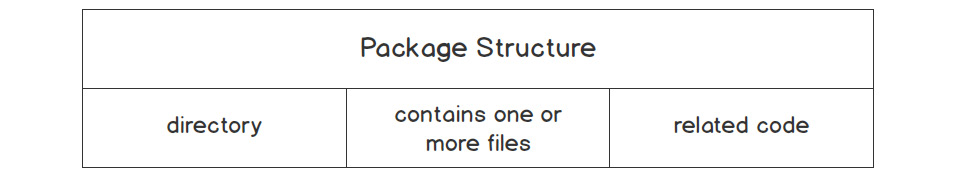
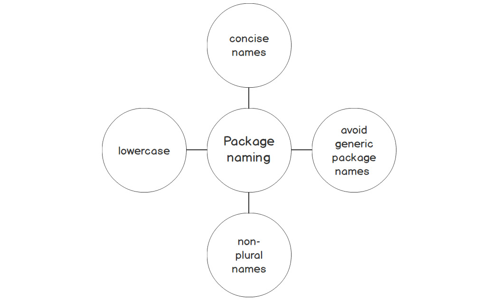
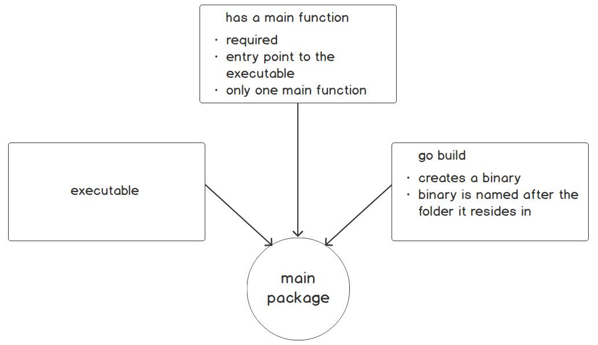
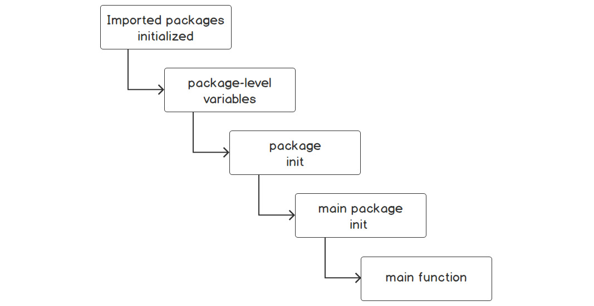

# Packages
- Packages can be used to assist our code be more maintanable, reusable and modular.
- Packages can be used to bring structure and organization to our code
- By the end of this, we will be able to describe a package and its structure and declare a package; learn to evaluate exported and unexported names in a package; create your own package and import your custom package. Also, we will be able to distinguish between an executable and non-executable package and create an alias of a package.

## Introduction
- When working on development teams with large codebases, the code written is larger with multiple files, libraries and with multiple people on the team.
- It will not be great for the developers if the code was not broken up into pieces where it will is manageable by the team.
- Go provides a way to do this by helping the developers modularize code (aka similar concepts or functions) into packages. This way of organizing code makes it easier to work with.
- When working with packages in Go, you can hide or expose different constructs like structs, interfaces, functions ...etc.
- Each package in Go can be thought of as a directory in which code files are placed. These files have a naminig criterion where the name has to be descriptive of the purpose the code performs.
  - Eg. for a package called `server`; you will have a directory called `server`; file(s) with names like `server.go` and in those files, you will call `package server` when starting the code.
- Packages in Go make the code maintainable, reusable and modular. These are core components of the software development that the language has managed to satisfy.
  - **Maintainable** : For code to be maintainable, it must be easy to change; and these changes must have a low risk of adversely impacting the program. Maintainable code must be easy to modify and extend and must also be readable. For businesses, having maintainable code means to be able to effectively match a competitor when new features come out.
  - **Reusable** : Reusable code is code that can be used in new software. Having reusable code decreases project costs by utlizing existion packages; decreases time to production; provide more time to spend on innovation in other parts of the project; increased quality of program as that package will have already undergone extensive testing.
  - **Modular** : Having modular code makes it easy to implement having reusable code. Having modular code makes it easy to find the code that performs a particular function. The idea of modularization is that, each discrete task that the code performs has its own section of code located at a specific spot.

## What is a Package?
- Go organizes its code for resuability into directories called packages.
- A package is essentially a dirrectory inside the workspace that contains one or more Go source files, useful for grouping code that performs a task.
- With packages, you expose only the neccessary parts of code needed by other pieces of code to get their job/task done.
- The steps to organizing code in Go: 

### Package Structure
- It does not matter to Go how many different files are in a package.
- In Go, code should be separated into as many files as makes sense for readability and logic grouping.
- All the files that are a part of a package have to live in the same directory. And the source files should contain code that is related. ie. if the package is for parsing configuration, it should not contain code for connecting to a database.
- The package structure of Go is shown: 
- A common package in Go is the `strings` package. It contains source files such as `strings.go; compare.go; builder.go; reader.go; replace.go; search.go`.

### Package Naming
- Naming a package should be like self-documenting. The name should represent what the package contains and also identify the purpose of the package.
- The name of the package should be short and concise. Simple nouns should be chosen for the package name.
- The conventions for package naming is illustrated below: 

## Package Declaration
- Every Go file starts with a package declaration.
- The package declaration is the name of the package. The first line of **executable code** must be the package declaration.
- All the functions, types and variables that are defined in the Go source file in a package are accessible within the package. All code is visible within the package.

### Exported and Unexported Code
- Go has a simple way of determining whether a piece of code is exported or unexported.
- Exported variables mean that the functions, structs, types, variables etc are exposed and can be accessed from outside. Unexported means that they are visible and can be accessed ONLY from INSIDE the package.
- The item is exportable if it starts with an uppercase letter, unexportable if it starts with a lowercase letter.
- **NOTE**: Expose only the code that we want to have accessed from outside the package. Everything else should be unexportable.
- An example is the `Contains` function from the `strings` package:
```go
// strings.go
// Contains reports whether substring is within s
func Contains(s substr string) bool {
  return Index(s, substr) >= 0
}
```
```go
import "strings"

func main() {
  str := "found me"
  if strings.Contains(str, "found") {
    fmt.Println("value found in str")
  }
}
```

### Package Alias
- Go allows to alias package names, ie to use a user-chosen name for a package instead of the default one.
- A few reasons to use aliases in packagaing are:
  - the default package name may not make it easy to understand the purpose of the package. For clarity purposes, you might want to use a much more descriptive name.
  - the default package name maybe too long and we want something that is concise.
  - scenarios where the package path is unique but the package names are the same. Using aliasiing will help differentiate between the two packages.
- The syntax for aliasing is relatively simple, in the import section, you place the alias name before the package to import. Eg. print is now our alias for the package name.
```go
import (
  print "fmt"
)

func main() {
  print.Println("Hello, Alias!")
}
```

### Main Package
- The main package is a special package.
- It is an executable package in Go.
- The main package requires the **main()** function to be in its package.
- The *main()* function is the entrypoint for a Go executable. When a **go build** is performed on the main package, it will compile the package and create a binary. This binary is created outside of the directory in which the main package resides. The default name of the binary will be the name of the folder it resides in.


### The init() Function
- The **init()** function adds some initialization logic to the package it is present it. With this said, the **init()** function can be put into any package at all.
- The **init()** function is used to set up states and values
- Some examples of hoew *init()* functions can be used in code is this:
  - setting up database objects and connections
  - initialization of package variables
  - creating files
  - loading configuration
  - verifying or repairing the program state
- The order of execution for an **init()** function is as follows: imported packages are initialized first, package-level variables, the package's init function called, main executed. 
- Some example code:
```go
import (
  "fmt"
)

var name := "Gopher"

func init() {
  fmt.Println("Hello, ",name)
}

func main() {
  fmt.Println("Hello, main function")
}
```
- **NOTE**: The *init()* function cannot have any arguments or return values.
- When working with multiple *init()* functions, they are executed in the order in which they come. ie from top to bottom.