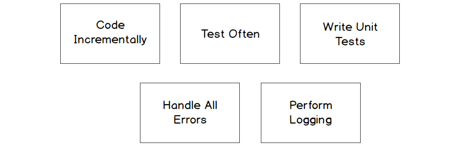
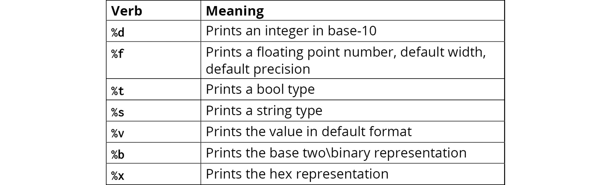
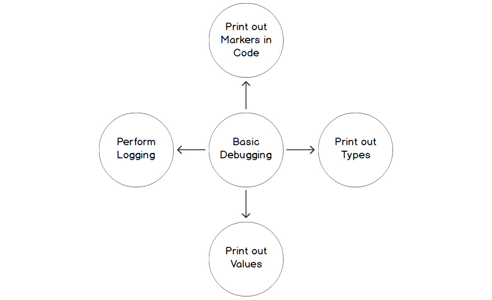
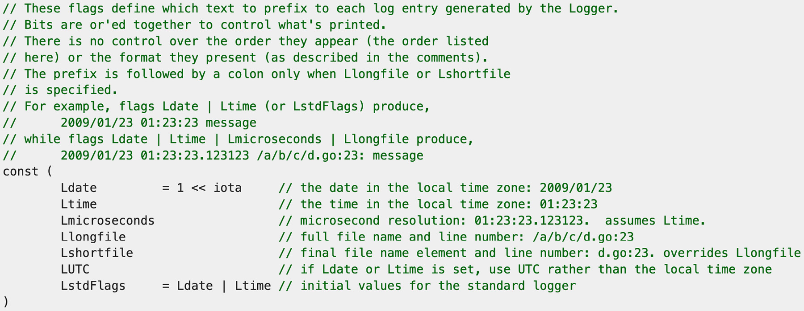

# Debugging
- This session will talk about some debugging methodologies that we can use.
- This session will also go into some of the proactive measures that can be taken to reduce the number of bugs that are introduced into a program.
- Also, we will investigate the ways through which we can locate a bug in a program.
- Basically, we will evaluate the various techniques to debugging: format printing and also logging the state of an application for debugging purposes.

## Introduction
- There are going to be times in developing program where it will behave in unintended ways. Eg. the program may crash (a crash is when the code stops functioning midway and exits abruptly), the program may be throwing up errors or even perhaps providing us with unexpected results.
- These unintended behaviour is what is called a **bug** in software development.
- The process of determining the cause of this unintended behaviour is called **debugging**.
- A few of the ways through which bugs get introduced into production code are as follows:
  - **testing being performed only at the end of the development cycle**: this can be mitigated by testing code incrementally ie. test each function as soon as it has been written before continuiing to add another function.
  - **application enhancements or changes to requirements**: changing production code might have adverse effects on the program running. Unit tests help to mitigate this by ensuring that new changes do not have a harmful effect on the running of the program.
  - **unrealistic development timeframe**: when functionality is to be delivered under a tight timeframe, this might lead to developers taking shortcuts around best practices to shorten the design phase, introducing less testing and receiving unclear requirements. All these have the chance of introducing bugs.
  - **unhandling of errors**: leaving errors unhandled cause the application to experience bugs.

## Methods for Bug-Free Code
- The methods are summarized with this diagram: 
- **Code incrementally and Test Often**: this meands developing the code incrementally and testing it after you add an incremental piece of code. This patterns helps to track bugs easily as you are testing per piece of code added and not against a large codebase.
- **Writing Unit Tests**: when a test is written and code changes occur, the unit test protects the code from potential bugs being introduced. Once a unit test fails, we can conclude that we have introduced a bug into the program.
- **Handling all Errors**: Just handle those errors.
- **Performing Logging**: Logging is a technique that we can use to determine what is going on in a program. There are various log levels: debug, info, warn, error, fatal and trace. 
  - The *debug* level is useful in debugging because it is used to determine the state of a program before a bug occurs. Some of the information gathered include: values of variables; code being executed; values of arguments being passed; outputs of functions/methods etc.
  - There are some performance implications to logging. Depending on the application and the load it is under, there could be extensive logging at peak times and that may have a negative impact on the application. In certain cases, application could be rendered unresponsive.

## Formatting using fmt
- One of the uses foo the **fmt** package is to display data to the console or print it to a text file where it can be read. This is useful for debuging code.
- Normally, the **fmt.Println()** is common BUT for debugging purposes, the **fmt.Printf()** function is the best to be used for these.
- The **fmt.Printf()** takes in a verb and formats the output to the console according to how the verb has been specified.
- These verbs used in conjunction with the **Printf()** function are: 
- These verbs can be thought of as placeholders for the types that they will be outputting.

## Basic Debugging
- We run our application and we get some errors. There are some steps that we can take to aid in remediating, or at the very least, gather information abou these bugs.
- The basic debugging methods are shown in the diagram. 
  - **printing out code markers in the code**: markers in the code are print statements that help us to identify where we are in the program when the bug occurred.
  - **printing out the type of variable**: in debugging, it is useful to know tha type of variable we are evaluating.
  - **printing out the value of the variable**: after printing out the variable, it will be useful to know the value stored in the variable.
  - **perform debug logging**: it might be necessary to print out the debug statements to a file for furhter investigations.
- In the process of debugging, a tool we can use is to print out the value in the way Go sees the value. This will be use the **`%#v`** in our **Printf()** statement.

## Logging
- Logging is another way we can debug an application/program.
- Logging primarily is not a way to debug an application but a way to gather information about what the application is doing. With this information in hand, we can have an effective debugging process.
- Logging needs to be performed regardless of whether the program needs debugging. It is useful for understanding the events that occur, the health of the application, who is accessing application and/or data and other stuff.
- Logging is used to track abnormalities that we would otherwise have missed in the application. Sometimes the application runs under different conditions compared to what we have in development, we need to log information on how the code performs under the new conditions or we could spend hours trying to figure out why the code behaves under the new conditions.
  - anothe example is that, the program gets some malformed data in production and the ode does not handle the format properly and this causes some undesired behaviour. Without logging, it may be time-consuming to determine the fact that the program received data that it did not adequately handle.
- The Go language provides a package called **log**. It provides basic logging infra that we can use for programs. Eg.
```go
import (
  "fmt"
  "log"
)

func main() {
  name := "Rick"
  log.Println("Demo show")
  log.Printf("Smartest man in the universe, %s is\n", name)
  log.Print("Worship")
}
```
- these log statements with the *Println()*, *Printf()* and *Print* work that normal way they do BUT the exception with log this time is that, there are additional details  such as date and time of execution.
- the addtional information is useful when investigating and reviewing logs at a later time and for understanding the order of events
  - there can be more information logged by the logger. The Go log package has a flag called **SetFlags** that allows the verbosity and specificity. The list of options are: 
  - here is how we can use these flags:
  ```go
  import (
    "log"
  )

  func main() {
    log.SetFlags(log.Ldate | log.Lmicroseconds | log.Llongfile)
    name := "Rick"
    
    log.Println("Demo Show")
    log.Printf("Smartest man in the universe, %s is.", name)
    log.Print("Run")
  }
  ```

### Log Fatal Errors
- The log package can be used to log fatal errors.
  - The functions used here are the **Fatal()**, **Fatalf()** and **Fatalln()**. They are similar to the Print function.
  - The significant thing about these Fatal functions is that when a log **Fatal()** is called, it executes an **os.Exit(1)** system call that aborts the program with no chance of recovery.
- The log package can also be used to log panics.
  - The functions used for the panic are **Panic**, **Panicf** and **Panicln**.
  - Logging panics are different from logging Fatals because Panics are recoverable. Any defer function / statement is called whilst in Fatals, they are not.
- Basically, when **os.Exit()** is called, no **defer** functions are executed.
- An instance to use log Fatals is when the application has gotten to a state were it is best to exit before data corruption or undesired behaviour kicks in. Or there is a CLI application where you need to provide an exit code to the callers of the executable to signal the end of its task.
- An example perhaps:
```go
import (
  "log"
  "errors"
)

func main() {
  log.SetFlags(log.Ldate | log.Lmicroseconds | log.Llongfile)
  log.Println("Starting the application")
  err := errors.New("Application Aborted")

  if err != nil {
    log.Fatalln(err)
  }

  log.Println("End of application")
}
```