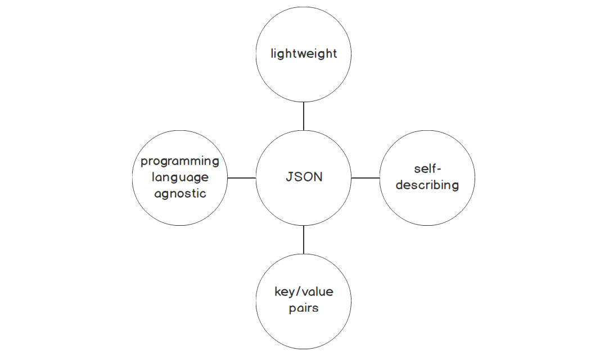
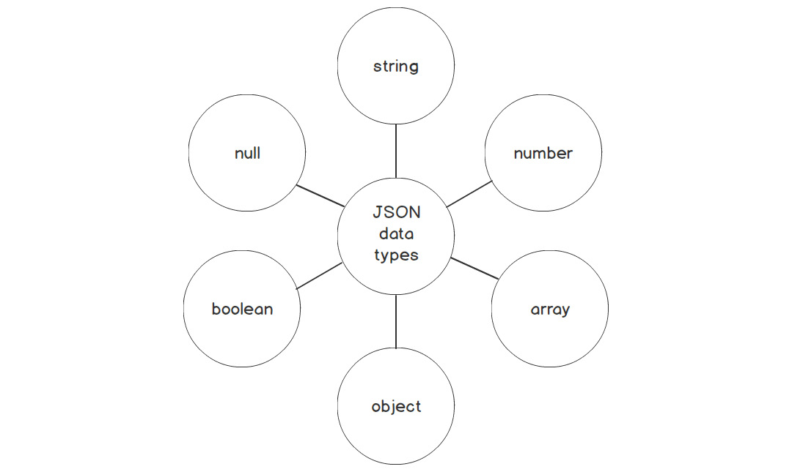
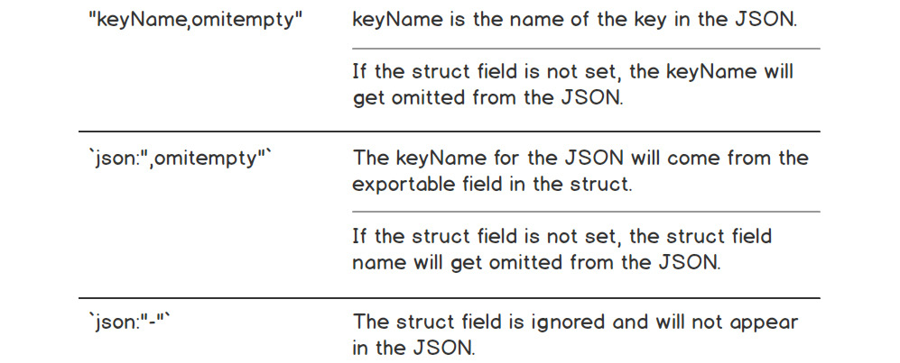

# Encoding and Decoding JSON
- In this section, we will get to know how to use Go to parse JSON; how to convert JSON into structs and vice versa.
- We will get to know how to describe and unmarshal JSON to a struct. Also how to marshal a struct to JSON and set the JSON key name to something different other than the struct field name
- Also, we will get to know how to use JSON tag attributes to control that gets converted to JSON, unmarshal a JSON structure and use encoding for data transmission.

## A Brief Introduction to JSON
- JSON stands or **Javascript Object Notation**.
- It is used widely by many programming languages for transferring and storing data. Often, this is done by transferring data from web servers to clients.
- JSON is transferred in web applications and even used to store data in a file for later processing.
- JSON is independent of any programming language; it is self-descriptive and easily readable and writable. 
- JSON is widely used as a data format for exchanging data between web applications and for varius server-to-server communications.
- JSON is used in the most common API specification, the REST API, because it is less verbose, lightweight and easier to read as compared to XML.
- Most modern database now store JSON as a data type in a field. Static web applications sometimes use JSON for rendering their web pages.
- The JSON format is very structured. The primary parts of a JSON format consists of a collection of key-value pairs.
  - The key is always a string enclosed in quotation marks, whereas the value can encompass a multitude of data types.
  - A key-value pair in JSON is a **key** name, followed by a **colon** and then a **value**. If there are additonal key-pairs, they are separated by commas.
  ```json
  {
    "firstname": "Captain",
    "lastname": "America"
  }
  ```
  - JSON can also contain arrays. The values are within a set of square brackets.
  ```json
  {
    "phonenumbers": [
      {
        "type": "business",
        "number": "0800-steal-your-girl"
      },
      {
        "type": "home",
        "number": "0800-kill-that-move"
      }
    ]
  }
  ```
  - The JSON object supports many data types as shown here: 
- JSON objects can be likened to structs in Go. Here are a json object and a Go struct side-by-side for comparison.
```json
{
  "person": {
    "firstname": "Randall",
    "middlename": null,
    "lastname": "Monday",
    "age": 32,
    "ismarried": false,
    "hobbies": ["Go", "Saving Earth", "Mischief"]
  }
}
```
```go
type person struct {
  firstname string
  middlename string
  lastname string
  age int
  ismarried bool
  hobbies []string
}
```

## Decoding JSON
- When we talk about decoding JSON, we mean taking that JSON data structure and convert it to a Go data structure.
- Converting the data structure from JSON to a Go data structure makes it easier to work with the data natively (in Go).
  - Eg. we can take an array from a JSON object, that will be decoded into a slice in Go; we can then iterate over the slice, get the length, append to the slice...etc.
- If we know what the JSON looks like ahead of time, we can use structs wehn parsing the JSON. In Go terms, it means that we need to be able to **unmarshal** the JSON-encoded data and store the results in the struct.
  - to be able to do this, we will need to use the **encoding/json** package and the **Unmarshal** function.
  - unmarshalling is the process of parsing JSON to a data structure. Unmarshalling and decoding are used interchangeably.
- The **Unmarshal** function is this:
```go
func Unmarshal(data []byte, v interface{}) error
```
  - the Unmarshal function takes in variable data defined as a slice of bytes and **v** is a pointer to a struct.
  - It takes the JSON data as a slice of bytes, and stores the results in the struct/value pointed to by **v**.
  - **NOTE**: the value **v** must be a pointer to a struct and not **nil**. If either of these errors are not met, then an error is returned.
- Let us walk through some code that does some unmarshalling of JSON data
```go
package main

import (
  "encoding/json"
  "fmt"
)

// the greeting struct has an exportable field called Message of type string
type greeting struct {
  Message string
}

func main() {
  // the JSON data is encoded in byte with backticks
  data := []byte(`
  {
    "message": "Greetings from planet Goph"
  }
  `)

  var g greeting

  // the json.Unmarshal struct requires that the JSON encoded data must be a byte of slices
  // the JSON data is then stored in the pointer to the greeting struct
  err := json.Unmarshal(data, &g)
  if err != nil {
    fmt.Println(err)
  }

  fmt.Println(g.Message)
}
```
- **NOTE**: to be able to unmarshal into struct, the struct field must be exportable. The struct's field name must be capitalized. Only fields that are exportable are visible externally, including the JSON unmarshaller. Only the exported fields will be in the output, other fields are ignored.

### Struct Tags
- We use struct tags to provide transformation information on how the struct field is marshalled or unmarshalled.
- The format of a tag is this `"key": "value"`. The tag begins and ends with a backtick(``).
- Look at the following example:
```go
type person struct {
  LastName string `json:"lname"`
}
```
  - Using tags in this situation above, we have more control over the name of our struct field as long as the struct field is exportable.
  - The JSON field that will be unmarshalled into the LastName field is *lname*.
- **NOTE**: Once tags are used for JSON marshalling and unmarshalling, the Go code will not compile if the struct field name is not exportable ie. does not start with a capital letter.
- using struct tags in an example code:
```go
package main

import (
  "encoding/json"
  "fmt"
)

type greeting struct {
  Message string `json:"message"`
}

func main() {
  data := []byte(`
  {
    "message": "Greetings from Goph"
  }`)

  var g greeting

  err := json.Unmarshal(data, &g)
  if err != nil {
    fmt.Println(err)
  }

  fmt.Println(g.Message)
}
```
- **IMPORTANT**: The Go JSON unmarshaller follows these steps to determine which struct field to map the JSON data when decoding it.
  1. an exported field with a tag
  2. an exported field name whose case matches the JSON key name
  3. an exported field name with a case-insensitive match
- We can also verify if whether a JSON we are going to unmarshal is valid or not. This uses teh **Valid()** function which takes in a slice of bytes as an argument and returns a bool that indicates whether a JSON is valid or not.
```go
func main() {
  data := []byte(`
  {
    "message": "Greetings from Goph"
  }`)

  if !json.Valid(data) {
    fmt.Printf("JSON is not valid: %s", data)
    os.Exit(1)
  }
  // rest of code
}
```
  - this is very useful for checking out the JSON before we try to unmarshal it into a Go struct.
- Let us test out how to transform a JSON object into a Go struct by looking at the code:
```json
{
  "lname": "Smith",
  "fname": "Morty",
  "address": {
    "street": "Sulphur Springs Road",
    "city": "Park City",
    "state": "Vancouver",
    "zipcode": "12345"
  }
}
```
```go
package main

import (
  "encoding/json"
  "fmt"
)

type person struct {
  LastName string `json:"lname"`
  FirstName string `json:"fname"`
  Address address `json:"address"`
}

type address struct {
  Street string `json:"street"`
  City string `json:"city"`
  State string `json:"state"`
  ZipCode string `json:"zipcode"`
}

func main() {
  data := []byte(`
  {
  "lname": "Smith",
  "fname": "Morty",
  "address": {
    "street": "Sulphur Springs Road",
    "city": "Park City",
    "state": "Vancouver",
    "zipcode": "12345"
    }
  }`)

  var p person
  
  err := json.Unmarshal(data, &p)
  if err != nil {
    fmt.Println(err)
  }

  fmt.Printf("%+v", p)
}
```

## Encoding JSON
- In encoding JSON, we will do the opposite of what we have done in decoding JSON, that is, instead of unmarshalling a JSON into a struct, we marshal a struct into a JSON. 
- We are taking a Go struct and converting it into a JSON data structure.
- Why do we do this?
  - a typical scenario in which this is done is: responding to an HTTP request from a client. The client wants the data in a certain format and that format is almost always JSON.
  - another scenario is data stored in a NoSQL database and it requires JSON as the format; or even a traditional database that has a column with a data type of JSON.
- The function/format for encoding JSON is with the `json.Marshal` function and this is the format:
```go
func Marshal(v interface{}) ([]byte, error)
```
  - the Marshal function takes in a **v** which is a struct (NOT A POINTER, this time around) and returns a slice of bytes and an error.
  - a best practice is to always check whether there was an error during the process of encoding the struct (**v**).
- Let us walk through an example of marshalling Go structs to JSON:
```go
package main

import (
  "encoding/json"
  "fmt"
)

type greeting struct {
  AnotherMessage string
}

func main() {
  var g greeting

  g.AnotherMessage = "Greetings from planet Kuzco!"

  json, err := json.Marshal(g)
  if err != nil {
    fmt.Println(err)
  }

  fmt.Printf("%s", json)
}
```
- Note that we did not provide a JSON tag for the struct. If we do this, the Go Marshal() function encodes the exportable field names with the values provided. In this case, the **key** of the field in the resulting JSON data will be **AnotherMessage**.

### Some Cool Stuff with Encoding
1. There are times when we do NOT want our struct fields to be marshalled to JSON when the fields are not set. - We can use a JSON tag attribute called **omitempty** and this will omit the struct field from there resulting JSON when that struct field value is empty.
```go
package main

import (
  "encoding/json"
  "fmt"
)

type book struct {
  ISBN string `json:"isbn"`
  Title string `json:"title"`
  YearPublished int `json:"yearpub,omitempty"`
  Author string `json:"author"`
  CoAuthor string `json:"coauthor,omitempty"`
}

func main() {
  var b book
  b.ISBN = "867HH234"
  b.Title = "Rosa, Que Linda Eres Tu"
  b.Author = "Sevdaliza"

  json, err := json.Marshal(b)
  if err != nil {
    fmt.Println(err)
  }

  fmt.Printf("%s", json)
}
```
  - **NOTE**: there should never be any space between the attribute **omitempty** and the JSON tag like this; `json:"coauthor, omitempty"`. THIS IS WRONG!!
  - Here are some more JSON tag field descriptions: 

2. Having the JSON output as a one-liner is not always ideal. In larger JSON data structures, it makes it harder to read.
- The Go JSON package has a function to format the JSON output to a readable format. Often called "pretty printing". This function is the **MarshalIndent()** function.
- The format of that function is:
```go
func MarshalIndent(v interface{}, prefix, indent string) ([]byte, error)
```
- An example to demonstrate this is:
```go
package main

import (
  "encoding/json"
  "fmt"
)

type person struct {
  LastName string `json:"lname"`
  FirstName string `json:"fname"`
  Address address `json:"address"`
}

type address struct {
  Street string `json:"street"`
  City string `json:"city"`
  State string `json:"state"`
  ZipCode string `json:"zipcode"`
}

func main() {
  var p person
  p.LastName = "Smith"
  p.FirstName = "Jerry"
  p.Address.Street = "Cronenberg Avenue"
  p.Address.City = "Conenberg"
  p.Address.State = "Washington"
  p.Address.ZipCode = "EARTH123"

  // no pretty printing
  noPrettyPrint, err := json.Marshal(p)
  if err != nil {
    fmt.Println(err)
    os.Exit(1)
  }

  // pretty printing
  prettyPrint, err := json.MarshalIndent(p, "", "    ")
  if err != nil {
    fmt.Println(err)
    os.Exit(1)
  }

  fmt.Println(string(noPrettyPrint))
  fmt.Println()
  fmt.Println(string(prettyPrint))
}
```

## Unknown JSON Structures
- When we know the JSON data structure beforehand, it enables us to design our structs to match the expected JSON. With support from Go, we can unmarshal JSON into our structs and vice versa.
- But life is not always like that.
- There may be situations in which we do not know the JSON structure coming in. Eg. a third-party tool that posts metrics. The format of the metric is in JSON and the metrics are very dynamic, they are frequently being changed. The producer changes these metrics and the consumer(me) needs to find a way to perform analysis on the new metrics as well as the old ones. BUT you see in this situation, we do not have the luxury of stopping our consumer service to update the struct fields, we need to continuously report on these with minimal interruption to the service.
- For JSON that is dynamic, we have to use the **map[string]interface{}** format. The keys of the JSON data will be the string keys of the map and the empty **interface{}** will hold all the values of those JSON keys.
  - Remember that every type implements the empty interface: 
- The **json.Unmarshal()** function will decode the unknown JSON structure into the map whose keys are strings and whose values are empty interfaces. This works out well because JSON keys have to be strings.
```go
package main

import (
  "encoding/json"
  "fmt"
)

func main() {
  jsonData := []byte(`"{checkNum}":123, "amount":200, "category":["gift","clothing"]}`)

  var v interface{} // var v any

  json.Unmarshal(jsonData, &v)
  
  fmt.Println(v)
}
```
  - the printing of the **map[string]interface{}** does not match the order the data is stored, the output comes out unordered.
- Remember that for unknown JSON, the keys are strings and the values are interfaces.
- A good thing is that we have the ability to access the concrete types; we can do a type assertion and then use that to access the concrete types of the **map[string]interface{}**.

#### NOTE: We can use the any keyword instead of the interface{} to represent an empty interface.

## GOB: Go's Own Encoding
- Go has its own encoding protocol called **gob**.
- **gob** can only be used when the encoding and decoding of data is happening in the same language ie. Go.
- Being limited to only Go is a deal-breaker but also not so much if the software being written is for internal use.
  - it is actually common for both the encoding and decoding software to be used in a company are written in the same language.
  - hence, it turns out the single-usage of **gob** is not so much of a disadvantage at all in most use cases.
- if you can use it, **gob** provides exceptionally high performance and efficiency.
  - JSON is a string-based protocol that needs to be useable within many different programming languages and this limits what is possible with JSON and protocols like it.
  - **gob** on the other hand is a binary-based protocol, and only needs to work for Go users. This frees gob to be a space- and processing-efficient encoding protocol while still maintaining usability.
- **gob** does not require any configuration to setup or use. It also does not need the sender's and/or receiver's data model to match exactly. This makes it efficient, quick and easy to use.
- **gob** is not strict when it comes to <u>*types*</u>. gob treats all numbers the same be they *int* or *float*.
- we can use pointers with **gob** and when encoding, gob will pull the value from the pointer for you. gob will set values to pointer or value types regardless of whether the value was encoded from a pointer or a value.
- **gob** can encode complex types such as structs. gob's flexibility continues here because it does not require the properties on the structs match. If there is a matching property on the struct it is decoding to, it will use it; if not, then it will discard the value. This gives the added benefit that you can add new properties without worrying about it breaking your legacy services.
- when using gob for communication between Go services, it is common practice to use Go's **rpc** package to handle the networking aspects of the communication between the services. The **rpc** package provides a simple way to make calls to other Go web servvices and by default, the **rpc** package uses gob to handle encoding duties. This means you will all get the benefits of using gob without having to do any extra work.
- using **gob** for **rpc** service-to-service communication will result in lower latency communications. Low latency communications are what allows for modern software architecture designs, such as microservices.
- to encode data using the gob protocol in Go directly, you use Go's **gob** package.
- encoding data using this package, it will return a **byte** slice. These byte slices are common in code for when dealing with files and networks. This means there are a number of helper functions for you to take advantage of.
- Gob is not limited to use only in networked solutions. You can also use gob to store data in files. A common use case for writing Go data to files is for making data resilient to server restarts. In modern cloud server deployments, if a server is starting to have problems, it gets killed, and your application is started up again on a new server. If you have any important data that's only in memory, it'll be lost.
- Prevent this loss by writing that data to a mounted filesystem attached to the server. When the replacement server starts, it attaches to the same filesystem, and on startup, your application recovers the data from the filesystem.
- One example of using files for data resilience is in transaction-based workloads. In a transaction-based workload, losing a single transaction can be a big problem. To prevent this from happening, a backup of the transaction is written to disk while your application is processing it. If a restart were to happen, your application would check these backups to ensure everything's in order. Using gob to encode this data would ensure it's written to the filesystem as soon as possible, minimizing the chance of data loss.
- Another use case is cold-start cache priming. When using a cache for performance reasons, you need to store it in memory. It's not uncommon for the size of this cache to grow to be gigabytes in size. A server restart means this cache is lost and needs reloading from the database. 
- If a lot of servers get restarted all at once, it causes a cache stampede, which could crash the database. A way to avoid this overload situation is to make a copy of the cache and write it to a mounted filesystem. Then, when your application starts up, it would prime its cache from the files and not the database. 
- Using gob to encode this data would allow much more efficient use of disk space, which, in turn, allows faster reading and more efficient decoding. This also means your server gets back online sooner.