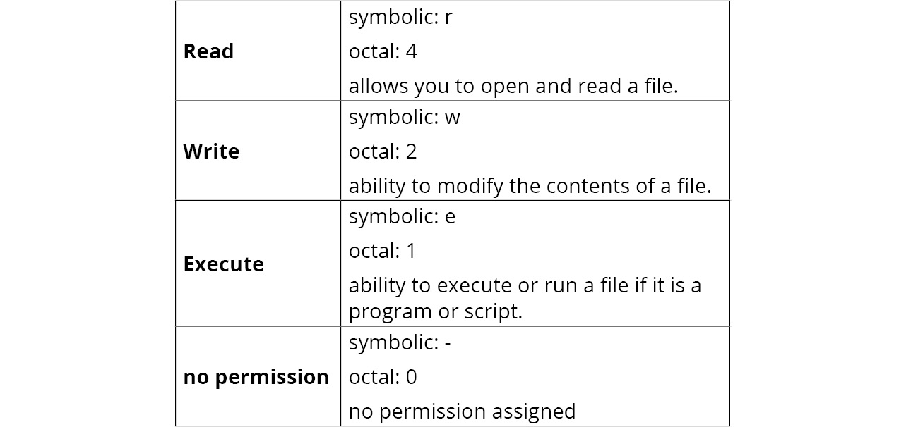

# Files and Systems
- In this section, we will learn how to interact with the filesystem; including creating and modifying files.
- We will check whether a file exists, leaern how to write to the file and save it on disk.
- We will learn to create command-line applications that accept various flags and arguments.
- We will learn how to catch signals and determine what to do with them before we exit the program.

## Introduction
- The interactions are going to be with the filesystem. Especially working with the filesystem at the file, directory and permission levels.
- The session will go deep into everyday developer problems when working with the filesystem; including how to create a command-line application that needs to accept arguments from the command line.
- The session will walk through how to create a command-line application that will read and write files.
- We will discuss and demonstrate what happens when we get a signal interrupt from the OS, demo how to perform cleanup actions before the application stops running. We will look at scenarios where the application is running and a signal comes from the OS to shut down the application; in such instances, we will want to log the information at the time of shutdown for debugging purposes, this will provide insight on why the application shut down.

### Filesystem
- A filesystem controls how a data is named, stored, accessed and retrieved on a storage device or medium.
- Every OS has a filesystem that has its own conventions for naming files; such as length, specific characters, the length of the suffix or file extension etc. There are some common file descriptors/metadata about a file that most filestystems contain such as file size, location, access permissions, date created, date modified etc...
- Files are organized in a hierarchical structure. The structure typically consists of directories and subdirectories. The placement of the files within these directories is a way to organize data adn get access to the file or directory.
- The filesystem is also responsible for who can access the directories and files.

### File Permissions
- Permissions are important when dealing with file creation and modifications.
- Go uses the native Linux nomenclature for representing permission types; in symbolic or octal notation. The three permission types are *Read*, *Write* and *Execute*.
- They are presented here: 
- The rest are Linux stuff that I already know about so I am skipping the rest of the lecture LOL.

## Flags and Arguments
- When writing Go programs that are executables, they are going to need to accept various inputs for them to work.
- Go has a package called **flag** in its standard library that makes this possible. The **flag** package is used to pass arguments, called flags in Go, to the executable program. The order of the flags being passed to the program do not matter.
- To define the flag, you (coder) must know thhat flag type that the program will be accepting. The flag package has many functions that it has predefined for passing flags.
  - here is a sample:
  ```go
  func Bool(name string, value bool, usage string) *bool
  func Duration(name string, value time.Duration, usage string) *time.Duration
  func Float64(name string, value float64, usage string) *float64
  func Int(name string, value int, usage string) *int
  func Int64(name string, value int64, usage string) *int64
  func String(name string, value string, usage string) *string
  ...
  ```
- The parameters for the preceeding functions are explained as follows:
  - *name* : this is the name of the flag; it is a string type. It is the name you pass the argument with. Eg. `app.exe -file`.
  - *value* : this is the default value that the flag is set to. When the value is not specified in the argument, this is the value that it defaults to.
  - *usage* : this parameter is used to communicate the correct way of using the flag and/or calling the flag.
  - *return value* : this is the address of the variable that stores the value of the flag/argument passed.
- An cool example:
```go
package main

import (
  "flag"
  "fmt"
)

func main() {
  v := flag.Int("value", -1, "Needs an int value for the flag.")
  flag.Parse()
  fmt.Println(*v) // pointer to the variable v, the return value.
}
```
- the flag arguments of the previous code are shown here: 
- Let us have a breakdown of the way the whole code works:
  - the variable **v** will reference the value for either **-value** or **--value**.
  - the initial value of the ***v** is the default value of -1 before calling the **flag.Parse()** function.
  - after defining the flags, we call **flag.Parse()** to parse the command line into the defined flags; calling this function here places the argument for **-value** into ***v**.
  - once the Parse() function has been called, the flags are now available to be used in the executable program.
- Let us have another example where we take a look at other flags being passed and parsed:
```go
package main

import (
  "flag"
  "fmt"
)

func main() {
  i := flag.Int("age", -1, "Your age (int).")
  n := flag.String("name", "", "Your first name")
  b := flag.Bool("married", false, "Are you married?")
  flag.Parse()

  fmt.Println("Name:", n)
  fmt.Println("Age:", i)
  fmt.Println("Married:", b)
}
```
- **NOTE** : For an executable, you have to build the code into a binary and run it with the arguments, that is one way of doing it.
- There is a point in the executable program where we want an argument to be necessary for the progrma to run. In this case, carefully choosing the default value is important. We can check to see whether the value of the flag is the default and whether it is exiting the program:
```go
package main

import (
  "fmt"
  "flag"
  "os"
)

func main() {
  i := flag.Int("age", -1, "Your age (int).")
  n := flag.String("name", "", "Your first name")
  b := flag.Bool("married", false, "Are you married?")
  flag.Parse()

  // making the flag necessary
  if *n == "" {
    fmt.Println("WARNING!: Name is required!")
    flag.PrintDefaults() // this prints the usage message to the user
    os.Exit(1)
  }

  fmt.Println("Name:", n)
  fmt.Println("Age:", i)
  fmt.Println("Married:", b)
}
```

## Signals
- A signal is an interrupt that is sent to our program or to a process by the Operating System (OS).
- When a signal is delivered to the program, the program will stop that is doing and (1) handle the signal or (2) ignore the signal.
- **defer** and **os.Exit()** are used the change the flow of a program BUT when signals are involved, these packages/methods do not effectively execute the job.
- Support for handling signals is built into the Go standard library, in the **os/signal** package.
  - this package allows to make the programs more resilient.
- The first thing to do when handling signals in Go is to **trap** or catch the signal we are interested in.
  - this is done by using the **Notify()** function. The format of the function is as follows:
  ```go
  func Notify(c chan <- os.Signal, sig ...os.Signal)
  ```
  - The **Notify()** function accepts an **os.Signal** data type on a channel, **c**. The **sig** argument is a variadic variable of **os.Signal**; we specify zero or more **os.Signal** data types that we are interested in.
- The following example shows how to handle a **syscall.SIGNINT** interrupt; akin to **CTRL-C**:
```go
package main

import (
  "os"
  "fmt"
  "os/signal"
  "syscall"
)

func main() {
  // create a channel of the os.Signal type. The Notify method works by sending values from the os.Signal type to the channel
  // the sigs channel is used to receive these notifications from the Notify method
  sigs := make(chan os.Signal, 1)
  // the done channel is used to let us know when the program exits
  done := make(chan bool)
  // the signal.Notify method will receive notification from the sigs channel, notifs of the syscall.SIGINT type
  signal.Notify(sigs, syscall.SIGINT)
  // create an anonymous goroutine function that blocks until the required signal is received
  go func() {
    for {
      s := <- sigs
      switch s {
        case syscall.SIGINT:
          fmt.Println()
          fmt.Println("My process has been interrupted. Someone pressed CTRL-C")
          fmt.Println("Some cleanup is occuring")
          // we send true to our done channel
          done <- true
      }
    }
  }() 

  fmt.Println("Program is blocked till a signal is caught")
  // the <- done channel will be blocking till the done channel receives the signal
  <- done
  fmt.Println("Out of here")
}
```
- The benefits of having to catch and work on signals that are passed to a program are mostly performing cleanup actions that include removing files, performing a last-minute log, freeing up memory etc.


## Creating and Writing To Files
- The package that helps to create files in Go is the **os** package.
- If you are familaiar with the Linux kernel, creating files is done with the *touch* command. The function to create a file in Go is done in the same fashion.
  - The signature of the function to create a file is:
  ```go
  func Create(name string) (*File, error)
  ```
  - The function takes in a name and the location you want to create the file; yes, location because if you specify the path to where the file should be created, it will do so for you. 
  - If the creation of the file is successful, it will return a `File` type.
    - the `File` type satisfies the `io.Write` and `io.Read` interfaces; ie the `reader` and `Writer` interfaces.
- Let us play around with creating our own file:
```go
package main

import (
  "os"
  "fmt"
)

func main() {
  f, err := os.Create("test.txt")
  if err != nil {
    panic(err)
  }
  defer f.Close()

  // let us write to the file we just created
  f.Write([]byte("Using the plain Write function.\n"))
  f.WriteString("Using the WriteString function.\n")
}
```
  - Delving into the code; we spot the `Write` method which accepts a slice of bytes and returns the number of bytes written and an error if there is any. The `Write` methos allows the `os.File` type to satisfy the `io.Write` interface. Below is the signature:
  ```go
  func (f *File) Write(p []byte) (n int, err error)
  ```
    - in the `Write` method, we are taking the string and converting it into a slice of bytes and then we write it to the `test.txt` file.
  - The `WriteString` method behaves the same as the `Write` method except that it takes in a string parameter versus a `[]byte` type.
- Go provides the ability to create and write to a file with the same single command. We will be leveraging the **os** package to accomplish this task.
  - the **os** package has the `os.WriteFile` method that handles this. Here is the signature:
  ```go
  func WriteFile(filename string, data []byte, perm os.FileMode) error 
  ```
  - An example of this usage is:
  ```go
  package main

  import (
    "os"
    "fmt"
  )

  func main() {
    message := []byte("Look!")
    err := os.WriteFile("file.txt", message, 0644)
    if err != nil {
      fmt.Println(err)
    }
  }
  ```
  - Here, in this code, if the file `file.txt` does not exist, it will create it and give it the Linux permission 0644. If the file exists, it will overwrite it.
- An interesting bit of code to play with here:
  - `in this snippet, we want the junk.txt file to not exist. And then we want the test.txt file to exist in the same directory as the program's executable binary.`:
  ```go
  package main

  import (
    "fmt"
    "os"
  )

  func main() {
    // we call the os.Stat on the junk.txt file to check whether it exists
    // the os.Stat() method will return a FileInfo type if the file exists, if not FileInfo will be nil and an error returned.
    file, err := os.Stat("junk.txt")
    // the FileInfo can return multiple errors. 
    // We must inspect the error to determine whether the error will be due to the file not being there.
    if err != nil {
      if os.IsNotExist((err)) {
        fmt.Println("junk.txt: File does not exist!")
        fmt.Println(file)
      }
    }

    fmt.Println()

    file, err := os.Stat("test.txt")
    if err != nil {
      if os.IsNotExist((err)) {
        fmt.Println("test.txt: File does not exist!")
      }
    }

    fmt.Printf("file name: %s\nIsDir: %t\nModTime: %v\nMode: %v\nSize: %d\n", file.Name(), file.IsDir(), file.ModTime(), file.Mode(), file.Size())
  }
  ```
  - the standard library provides an `os.IsNotExist(error)` error which can be used to check to see whether the error is the result of the file not existing. `IsNotExist` returns a boolean indicating whether the error is know to report that a file or directory does not exist.


### Reading The Whole File At Once
- We will look at two methods that read all the contents of a file.
- These two methods are ONLY good to use when the file size is small. The major drawback being that if the file is too large, it could lead to memory exhaustion on the system
- It is very important to keep these in mind as you work with these methods and the file sizes you are dealing with.
  - These methods are one of the quickest ways to load data BUT understand that they should only be limited to small files.
1. The first method we will examine for reading a file is:
```go
func ReadFile(filename string) ([]byte, error)
```
  - the `ReadFile` function reads the contents of a file and returns it as a slice of bytes along with any reported errors.
  - a successful call returns `err == nil`. In some other read methods, the `EOF` is treated as an error. This is not the case for functions that read the entire file into memory, like `ReadFile`.
  ```go
  package main

  import (
    "fmt"
    "os"
  )

  func main() {
    content, err := os.ReadFile("test.txt")
    if err != nil {
      fmt.Println(err)
    }
    fmt.Println("File Contents: ")
    fmt.Println(string(content))
  }
  ```
2. The second function that reads the entire content to memory is:
```go
func ReadAll(r io.Reader) ([]byte, error)
```
  - the ONLY difference between the `ReadFile` and `ReadAll` is the fact that, `ReadAll` takes in `io.Reader` as an argument.
  - an illustration of this is this:
  ```go
  package main

  import (
    "os"
    "fmt"
    "strings"
  )

  func main() {
    file, err := os.Open("test.txt")
    if err != nil {
      fmt.Println(err)
      os.Exit(1)
    }

    content, err := os.ReadAll(file)
    if err != nil {
      fmt.Println(err)
      os.Exit(1)
    }

    fmt.Println("File Contents:")
    fmt.Println(string(content))

    r := strings.NewReader("No file here.")
    c, err := os.ReadAll(r)
    if err != nil {
      fmt.Println(err)
      os.Exit(1)
    }

    fmt.Println()
    fmt.Println("Contents of strings.NewReader: ")
    fmt.Println(string(c))
  }
  ```
  - the `io.ReadAll` method requires an `io.Reader` as an argument. The `os.Open` method returns an `*os.File` type that satisfies the `io.Reader` interface.
  - since the `io.ReadAll` method accepts an interface, this has some flexibility advantages and allows it to have more uses.
  - in the code, we used the `strings.NewReader` which takes in a string and returns a `Reader` type that implements the `io.Reader` interface. This allows us to use the `io.ReadAll` method without havin a file to read from.

### Appending To A File
- There are times when we want to append additional information to a file.
- We have a function/method, `os.OpenFile` that provides us with this ability.
- We will use `Open` or `Create` to open or create processes, however to append data to the file, we will have to use `OpenFile`.
- The signature of the method is as follows:
```go
func OpenFile(name string, flag int, perm FileMode) (*File, error)
```
- The unique parameter here is the `flag` parameter. This is used to determine what actions to allow when opening the file. This is not to be confused with the FileMode, which is used to assign permissions to the file itself.
- Here is a list of `flag`s that can be used to Open a File:
```go
// Flags to OpenFile wrapping those of the underlying system
// Not all flags may be implemented on a given system
const (
  // Exactly one of O_RDONLY, O_WRONLY or O_RDWR must be specified
  O_RDONLY int = syscall.O_RDONLY // open the file read-only
  O_WRONLY int = syscall.O_WRONLY // open the file write-only
  O_RDWR int = syscall.O_RDWR // open the file read-write

  // the remaining values may be or'ed in to control behaviour
  O_APPEND int = syscall.O_APPEND // append data to the file when writing
  O_CREATE int = syscall.O_CREATE // create a new file if none exists
  O_EXCL int = syscall.O_EXCL // used with O_CREATE, file must not exist
  O_SYNC int = syscall.O_SYNC // open for synchronous I/O
  O_TRUNC int = syscall.O_TRUNC // truncate regular writable file when opened
)
```
- We will now be looking at various examples where these flags can be used:
```go
package main

import (
  "os"
)

func main() {
  file, err := os.OpenFile("junk101.txt", os.O_CREATE, 0644)
  if err != nil {
    panic(err)
  }
  defer file.Close()
}
```
```go
package main

import (
  "os"
)

func main() {
  file, err := os.OpenFile("junk102.txt", os.O_CREATE|os.O_WRONLY, 0644)
  if err != nil {
    panic(err)
  }
  defer file.Close()
  // write to the file
  if _, err := file.Write([]byte("adding junk stuff.\n")); err != nil {
    panic(err)
  }
}
```
```go
package main

import (
  "os"
)

func main() {
  file, err := os.OpenFile("junk103.txt", os.O_CREATE|os.O_WRONLY|os.O_APPEND, 0644)
  if err != nil {
    panic(err)
  }
  defer file.Close()
  // write to the file
  if _, err := file.Write([]byte("adding more junk stuff.\n")); err != nil {
    panic(err)
  }
}
```

## CSV (Comma-Separated Values)
- The CSV is one of the common ways data is structured.
- The CSV data file is a cleartext file; the data is arranged as rows and columns BUT each piece of data is separated by commas and then a new line is used for another record.
- An example of data in the CSV format is this:
```csv
firstname, lastname, age
Cecelia, Frank, 23
Jimmy, Fitzsimmons, 24
```
- CSV data is very commonly used and Go has a package that is useful for handling these data; the `encoding/csv` package.
- Taking a crack at a sample way this package works with CSV files:
```go
package main

import (
  "encoding/csv"
  "fmt"
  "io"
  "log"
  "strings"
)

func main() {
  in := `
  firstname, lastname, age
  Cecelia, Frank, 23
  Jimmy, Fitzsimmons, 24
  Aegon, Targaryean, 17
  `
  r := csv.NewReader(strings.NewReader(in))
  for {
    record, err := r.Read()
    if err == io.EOF {
      break
    }
    if err != nil {
      log.Fatal(err)
    }
    fmt.Println(record)
  }
}
```
  - for the `r := csv.NewReader(strings.NewReader(in))`, the `NewReader` method takes in an argument of type `io.Reader` and returns a type of `Reader` that is used to read the CSV data.
  - in the for loop, we are reading each record. After reading one, we then check to see whether we have reached the end of the file (`io.EOF`). If so, we break out of the loop. The `r.Read()` function reads one record, ie, a slice of strings from the `r` variable and returns that record as a `[]string` type.
- There are instances where we just want to access a certian part of the records/data in the CSV file. Here is a piece of code to do that:
```go
package main

import (
  "encoding/csv"
  "fmt"
  "io"
  "strings"
  "log"
)

func main() {
  in := `firstname, lastname, age
Cecelia, Frank, 24
Jimmy, Fitzsimmons, 17
Yoofi, Appiah, 23`

  r := csv.NewReader(strings.NewReader(in))
  header := true
  for {
    record, err := r.Read()
    if err == io.EOF {
      break
    }
    if err != nil {
      log.Fatal(err)
    }

    if !header {
      for idx, value := range record {
        switch idx {
        case 0:
          fmt.Println("First Name: ", value)
        case 1:
          fmt.Println("Last Name: ", value)
        case 2:
          fmt.Println("Age: ", value)
        }
      }
    }
    header = false
  }
}
```
  - the most interesting thing here is the `headers`. The headers are the first records in a CSV, they are the...headers.
  - in this code, we set the `headers` to be `true`.
  - we then check to see if this was the first iteration of the loop. If it is, then the first row would be the headers of the fields and we do not want to parse the headers as records.
  - the `switch idx` statement is used to perform the specific parsing of each field.
  - initially, the headers are set to true. After the first time through the loop, they can be set to false