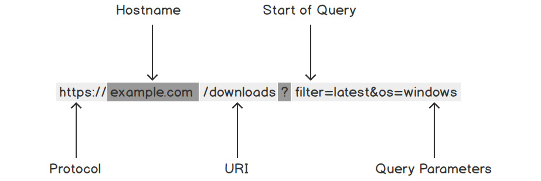

# Using the Go HTTP Client
- In this session, we will learn how to use Go to talk to other systems over the internet.
- We will focus on how to use the HTTP Client to get data from a web server and also how to send data to a web server.

## Introduction
- An HTTP Client is something that is used to get data from or send data to a web server.
- A well-known example of an HTTP client is a web browser
  - when you enter a web address into a web browser, it has a built-in HTTP client that sends data to a web server.
  - the web server will gather the requested data and send it back to the HTTP client, which will in turn display the web page in the browser.
- Also in this session, we will get to use the HTTP client in different ways and monitor their interactions with a web server and the various use cases for those interactions.

## The Go HTTP Client And Its Uses
- The Go HTTP Client is a part of the standard library in Go, particularly the `net/http` package.
- There are two(2) main ways to use this:
  - the first is to use the default HTTP client in the `net/http` package. It is simple to use angd you can get things up and running in no time.
  - the second way is to create your own HTTP client based on the default HTTP client. With this approach, you can customize the configuration of certain things like the requests. It takes longer to configure but there is the added benefit of more freedom and more control over the requests sent.
- When using the HTTP clients, there are many request types to be sent. The two most common ones are:
  - **GET**: used to retrieve data from a web server; and
  - **POST**: used to send data to a web server.

## Sending A Request To A Server
- When you want to make a request to a server, you must have information about that server.
- The information about a server is housed in a URL (Uniform Resource Locator). The URL will contain the information on the resource you want the data from.
- The URL can be broken down into some key parts show below: 
  - The **Protocol** tells the client how to connect to the server. The two main protocols are HTTP and HTTPS.
  - The **Hostname** is the (web) address of the server we want to connect to.
  - The **URI** is the **Uniform Resource Identifier**. This tells the server the path to the resource we want.
  - The **Query Parameters** tell the server of any additional information it needs. Multiple parameters are separated by a **&** and these query params are separated from the URI with a **?**.

## Structured Data
- In order to get the full use of using HTTP to communicate with servers, we need data to ber returned in a format that is ideally machine-readable.
- The common data type that we are looking for here is JSON. The format that web APIs communicate with.
- This is because JSON has a good structure for data that is both machine-readable and human-readable.

## Sending Data To A Server
- It is a delight to get data from a web server, another absolute delight is to push data to a web server.
- We can send data to a server via a POST request. The POST request has two main parts; the URL and the Body.
  - The Body is where you put the data you want to send to the server.
  - The URL is the URL (lol)
- An example of using a POST request is having to log into a server. You are met with a login form that takes your data and authenticates you to the server.

## Uploading Files In A Post Request
- Another example of data that can be sent to an HTTP server is a file from the local computer. This is how we can upload photos and all the other things we send to be stored in an online server.
- This is more complex than just sending simple form data. To achieve this; (1) the file needs to be read first, then, (2) wrapped in a format that the server can understand. Then it can be sent to the server in what is called a multipart form.

## Custom Request Headers
- There is more to sending a request than simply making a request or sending data.
- More infomration can be stored in the request headers that can be utilized for somthing important when the request gets to its destination.
- A common example is an authorization token; when you log into a server, it will respond with an authorization token. And in turn, in all future requests to the server, this token will be included in the headers so that the server knows that the same individual is making the request.
- Authorization headers are useful when communicating with APIs. These APIs require them.