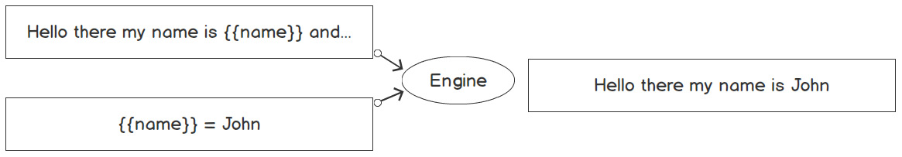

# HTTP Servers
- In this section, we will introduce many different ways of creating an HTTP server in order to accept requests from the Internet.
- We will be able to understand how a website can be accessed and how it responds to a form. Also, we will go into how to respond to requests from another software program.
- We will learn how to create an HTTP server rendering complex data structures which serves local static files; rendering dynamic pagesand work with different ways of routing.


## Introduction
- Previoulsy, we looked at how we can contact remote servers to obtain information. Now, we will dig into how the remote server is created and how to reply to requests using the newly created servers.
- A web server is (1) a program that uses the HTTP protocol, (2) to accept requests from an HTTP client and (3) respond to them with an appropriate message.
  - if we search the wb with our browser, the browser is the HTTP client we send requests from and the website we query is the HTTP server.
- Some HTTP server provide an interface that can be consumed by other programs, the interface is known as an API (Application Programming Interface).
- These APIs respond with structured data and the way these API serversexoect the format of the requests to be cna be also different. Some expect the same type of structured data they return while some others provide a REST API, which is strict with the HTTP methods used and expects inputs in the form of URL parameters or values.


## How to Build a Basic Server
- A server is a program the accepts requests and in order to do that it needs to have the follwowing things to be discussed one-by-one in the coming docs.

### HTTP Handler
- In order to react to an HTTP request, we need somthing that will take the request and do something about it. We call this the **handler**.
- There a ways to do this in Go but the one people tend to float to most of the time is to (1) implement the handler interface of the HTTP package. This interface has one method that is also self-explanatory.
```go
ServeHTTP(w http.ResponseWriter, r *http.Request)
```
- Hence, whenever we need to create a handler for HTTP requests, we can create a struct including this method and use it to handle HTTP requests.
```go
type MyHandler struct {}
func (h MyHandler) ServeHTTP(w http.ResponseWriter, r *http.Request) {}
```
- Above, the code provides a valid HTTP handler that can be initialized and used this way:
```go
http.ListenAndServe(":8000", MyHandler{})
```
  - the *ListenAndServe* is a function that will use our handler to serve the requests.
- The *ServeHTTP* method accepts a *ResponseWriter* and a *Request*. These are used to capture paramaters from the request and write data back to the response/as the response.
  - we can let the server return a simple message as a response when it is called upon
  ```go
  func (srv server) ServeHTTP(w http.ResponseWriter, r *http.Request) {
    w.Write([]byte("Hello there!"))
  }
  ```
- The *ListenAndServe* function might return a response that is an error. We can catch this error and handle the way the server reacts by wrapping this in a fatal log.
```go
log.Fatal(http.ListenAndServe(":8000", MyHandler{}))
```
*see exercise 15.01*

### Simple Routing
- Provided we want to have our server be a little more dynamic and have different paths that serve different things, we introduce routing in the server.
- A path is what we see after the port number in the URL and they are preceeded by a **/**.
- In order to introduce routing in the server, Go provides a function:
```go
HandleFunc(pattern string, handler func(ResponseWriter, *Request))
```
- In the function, the pattern is the path we want to be served by the **handler** function. The **handler** function signature has the same parameters as the same **ServeHTTP** method.

### Handle vs HandleFunc
- I would have loved to write a lot about this particular topic but I heard on Go Time (a podcast) that for creating an API, it is better to use the http.Handle func.
- The http.Handle func has an interface that can be used to hook things up and also allow communication between other programs from different programming languages without having to do globbing.
- The http.HandleFunc is the shorter and faster way to register a path/route to a server.
*see activity 15.01*

### Returning Complex Structures
- Plain Go standard libraries can be used to create production-grade websites but others will want to use **revel** or **gin** for this purpose.
- Web services are not only limited to services that should be consumed by human through a browser. We are going to learn how to make wweb services available to be consumed by another program.
- In order to present a message to another program, which in this case is the client, it will involve presenting the data in a structured form that can easily be parsed.
- The new lightweight format used nowadays is the JSON format.
- We will learn to build a data structure and send it to a client in the form of a JSON string.
*see activity 15.02*

### Dynamic Content
- Moving on to servers that serve dynamic content. An HTTP request can deliver content depending on hoe granular the request sent to it is.
- A more granular request my take the form of some variables being passed as a querystring to the server.
  - the **querystring** is simply a string that represents a query. It can look like this: `http://localhost:8000?name=John`. A variable *name* is being set to a value *John* and this is sent to the server.
- This way of passing more granular requests to the server is done with **GET** requests. **POST** requests take these queries in the body of the request, like through form data.
*see exercise 15.03*

### Templating
- In the case where the HTTP server content will be consumed by humans, complex data structures like JSON will not be the optimal choice (they are, in the case of communicating with other software programs).
- **NB**: the chosen way to format a text is the *fmt.Sprintf* function, which is good for formatting texts but insufficient for working with more dynamic and complex data
- In the last exercise, we passed a parameter to the URL. We can make this a pattern that we can continually use. This new way is called a **template**.
- A template is simply a skeleton from which complex entities can be developed.
  - Illustratively, a template is like a text with some blanks and a template engine will take some values and fill the blanks. As shown below: 
- Go provides two different templating packages; one for texts (text/template) and one for HTML (html/template).
- These templating packages have the same interface and can do the same thing but for HTML documents, the safer option is the *html/template*.
  - One of the templating engines which are not a part of the standard packaging is the **hero** templating engine which is faster than the standard Go templating package.
- Let us tallk more about the way the templating works as illustrated in the image above.
  - The blanks are denoted by the parameter keys in the double curly braces (**{{key}}**). This is the placeholder for the value of the parameter value passed in the URL string.
  - It works like a simple search-and-replace block. More complex situations are handled via conditionals like these `{{ if age }} Hello {{ else }} bye {{ end }}`. In this example, if the age parameter is not null, the template blank will be filled with "Hello" otherwise, it has "bye". The end of the conditional is denoted by the **{{ end }}** placeholder.
  - These variables in the template are not limited to only simple integers/numbers and strings, they can also be objects. 
    - An example will be if we have a struct with a field called **ID**, we can reference this field in the template this way: `{{ .ID }}`, not the **.**.
*see exercise 15.04*

### Static Resources
- In the case where we have to make the we application distributed in order for our users to pass in custom messages of their choice, the best way will be to use resources that will support this customization.
- Customization, may be that the server has to present a different message instead of a hardcoded message ("Hello World").
  - We can achieve this customization by using static files that will not be compiled at build time and served, but files that can be compiled at runtime and served to fit the desire of the user.
  - In this way, dynamic messaging is born. Which is the heart od a proper web application.
- The best way to serve custom resources in a web application will be to use dynamic files with a static template that will be loaded and used by the application at runtime.
- From here on out, we will be building a custom full-fledged web application that serves static files.
*see exercise 15.05*

#### BREAKPOINT
- I am skipping over a few things that have to do with serving HTML and CSS files from templates.
- I am doing so because I am getting bored with the lecture on that and I do not want to learn web development now.
- I will however add the final part of the lecture that has to do with building a server that accepts JSON payloads and sending JSON data to it using Postman.

### JSON Payloads
- Building on the sentiment that not all HTTP servers are to be used by humans through browsers, we are going to look at how to send JSON between two servers.
*see exercise 15.08*